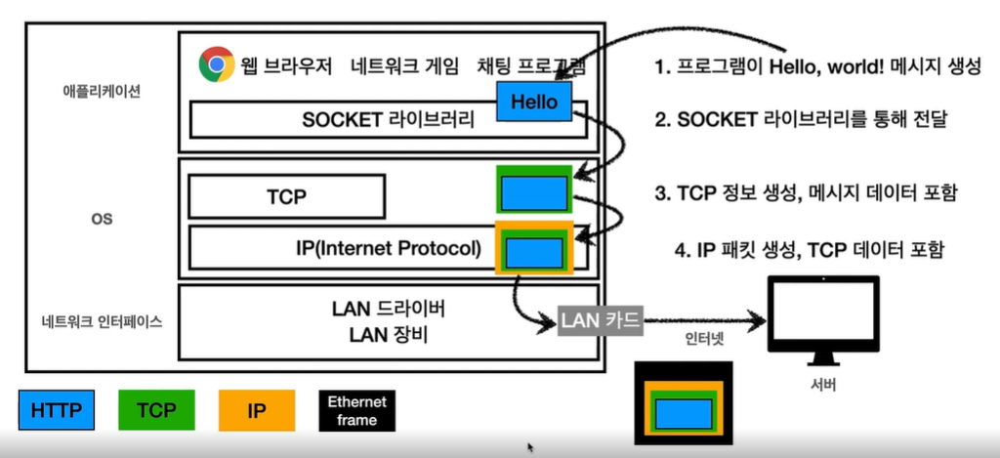
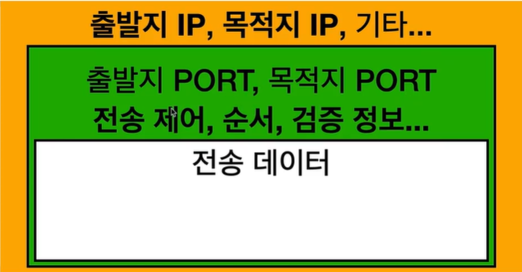
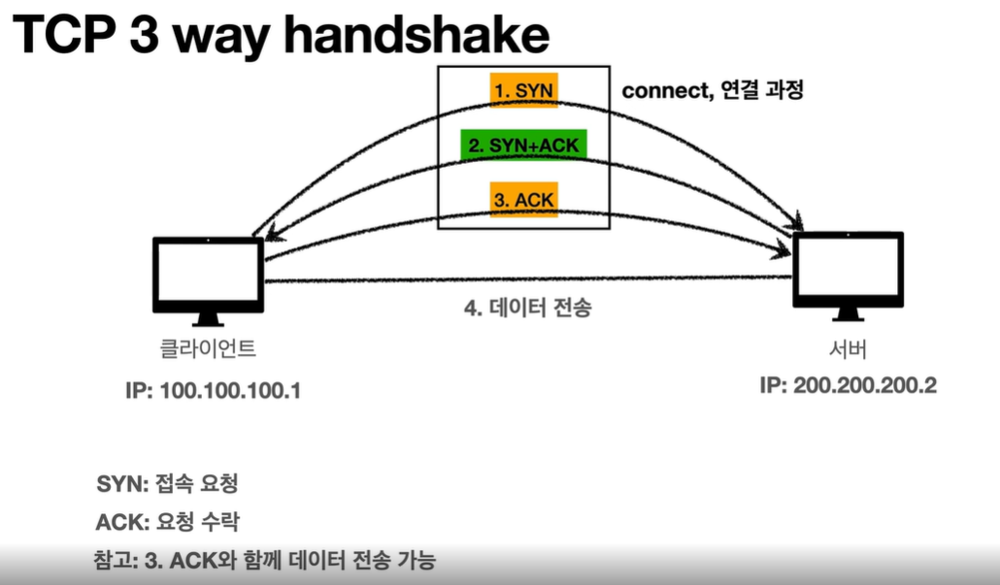
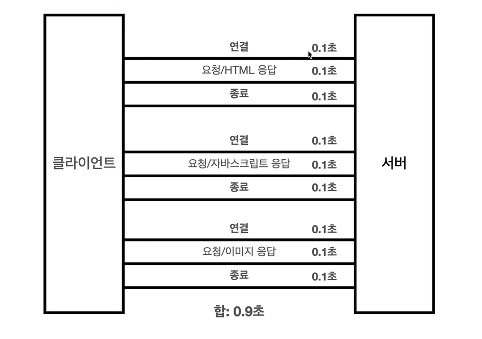
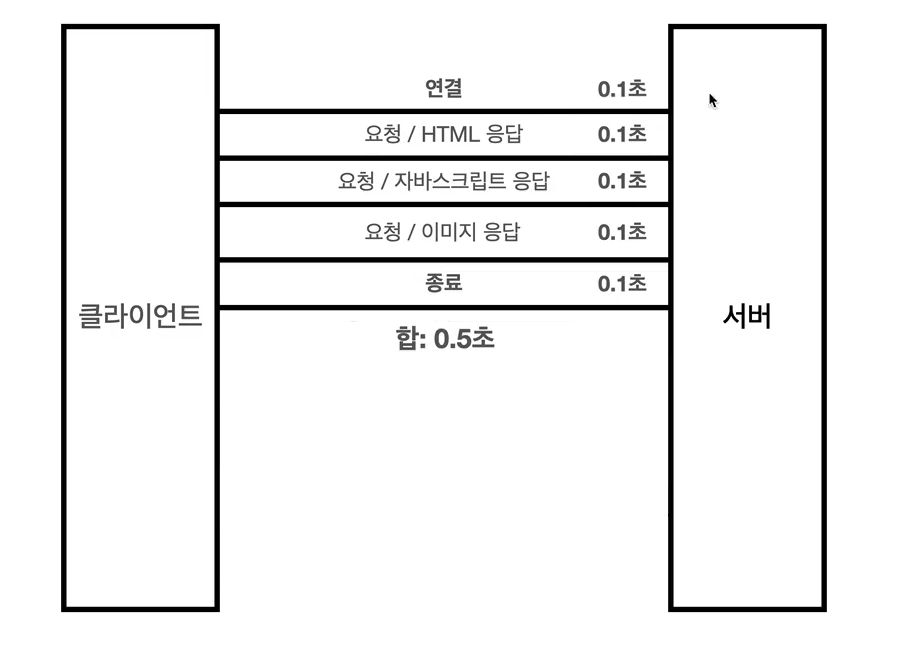
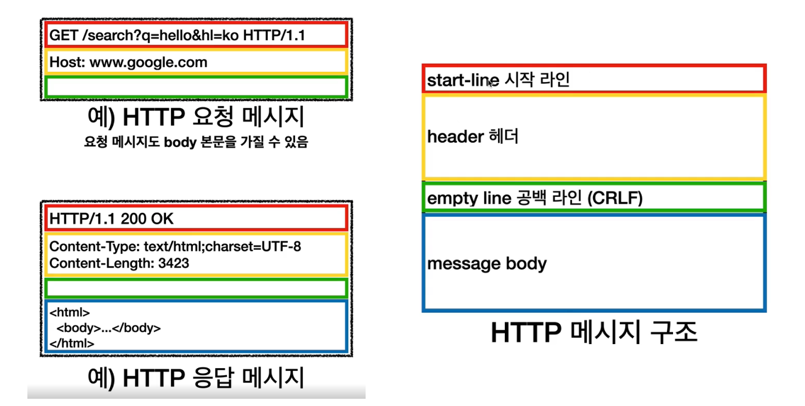
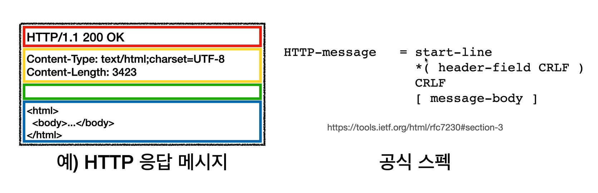
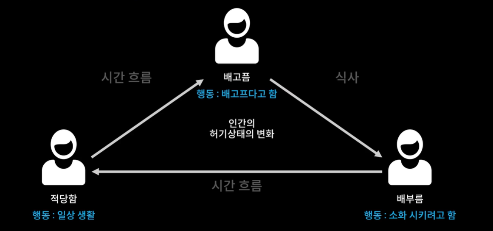

# 목차
[HTTP 웹 기본 지식](#http-웹-기본-지식)
- [1월19일](#1월19일)
  - [인터넷 통신](#인터넷-통신)
  - [IP (인터넷 프로토콜)](#ip-인터넷-프로토콜)
- [1월20일](#1월20일)
  - [TCP, UDP](#tcp-udp)
- [1월25일](#1월25일)
  - [PORT](#port)
  - [DNS](#dns)
- [1월27일-1](#1월27일-1)
  - [URI](#uri)
- [1월28일-1](#1월28일-1)
  - [웹 브라우저 요청 흐름](#웹-브라우저-요청-흐름)
- [1월29일-1](#1월29일-1)
  - [모든 것이 HTTP](#모든-것이-http)
- [1월30일-1](#1월30일-1)
  - [클라이언트 서버 구조](#클라이언트-서버-구조)
  - [Stateful, Stateless](#stateful-stateless)
- [1월31일](#1월31일)
  - [비 연결성(connectionless)](#비-연결성connectionless)
  - [HTTP 메시지](#http-메시지)

[React 기초](#react-기초)
- [1월27일-2](#1월27일-2)
  - [Create React App](#create-react-app)
- [1월28일-2](#1월28일-2)
  - [JSX](#jsx)
- [1월29일-2](#1월29일-2)
  - [State(상태)](#state상태)
- [1월30일-2](#1월30일-2)
  - [Props](#props)

[TIP](#tip)
<br/>

# HTTP 웹 기본 지식
## 1월19일

## 인터넷 통신

#### 인터넷 네트워크에 대해서 기본적으로 알아야 할 5가지 개념
- 인터넷 통신
- IP(Internet Protocol)
- TCP, UDP
- PORT
- DNS
<br/>

기본적으로 컴퓨터 둘을 연결하려면 케이블을 연결하면 된다.

> 근데 중간에 인터넷이 있으면 복잡해진다.

한국에서 미국에 있는 서버로 Hello, world를 보내는 방법은 복잡하다.

중간에 해저 광케이블이 있을 수도 있고 인공위성을 통해 내려갈 수도 있고 등의 수 많은 중간 노드라고 하는 서버들을 거쳐서 가야 한다.

그럼 출발점에서 목적지까지 안전하게 갈 수 있는 규칙들은 무엇일까?

그것을 알기 위해서는 IP(인터넷 프로토콜)에 대해 알아야 한다.
<br/>
<br/>

## IP (인터넷 프로토콜)

복잡한 인터넷 망에서 ex) 한국에서 미국까지 Hello world를 안전하게 보내려면 최소한의 규칙이 있어야 한다. 

그게 바로 IP 주소다.

ex) Hello world 를 보내기 위해서는 클라이언트(한국)와 서버(미국) 모두 아이피 주소를 받아야 한다.

ex) 클라이언트(한국) = IP: 100.100.100.1

ex) 서버(미국) = IP: 200.200.200.2

이때 IP (인터넷 프로토콜)이 하는 역할은 지정한 IP 주소에 데이터를 전달하며 패킷이라는 통신 단위로 데이터를 전달한다.

IP 패킷에는 규칙이 있다.

전송데이터를 출발지 IP, 목적지 IP, 기타..로 감싸?야 한다.

그 후 인터넷 망에 내보낸다.

중요한 점은 인터넷 망에 던져진 후 수 많은 노드를 거쳐 가는데 !! 클라이언트 패킷(요청) 전달과 서버 패킷(응답) 전달은 거쳐가는 노드가 다를 가능성이 있다.

여기서 IP 프로토콜의 한계가 발생한다.

1. (비연결성) 패킷을 받을 대상이 없거나 서비스 불능 상태여도 패킷 전송 ex) 우편을 지정 주소로 보냈는데 그 주소에 대상자가 없거나 살고 있지 않은 경우

2. (비신뢰성) 중간에 패킷이 사라지거나, 전송한 패킷이 순서대로 전달이 되지 않는 경우 ex) 곰이 케이블을 끊었다, 1번 패킷의 용량이 너무 커서 용량이 작은 2번 패킷이 먼저 전달된다(패킷이 내부적으로 더 빠르다고 판단되는 노드를 선택해서 중간에 다른 노드를 탈 수 있다). 

3. (프로그램 구분) 같은 IP를 사용하는 서버에서 통신하는 애플리케이션이 둘 이상일 경우 ex) 한 pc에서 인터넷으로 게임도 하고 음악도 듣는다.

이런 문제들을 해결할 수 있는 것이 TCP, UDP다.
<br/>

## 1월20일

## TCP, UDP

### TCP

먼저 알아야 할 개념은 인터넷 프로토콜 스택의 4계층이다.

( 인터넷 프로토콜 스택의 4계층 )

- 애플리케이션 계층 - HTTP, FTP
- 전송 계층 - TCP, UDP
- 인터넷 계층 - IP
- 네트워크 인터페이스 계층



쉽게 생각하면 애플리케이션 -> 네트워크 인터페이스 방향으로 데이터를 전달한다.

데이터가 전달될 때마다 그 데이터를 패킷이 감싼다고 생각하면 되고 최종적으로 네트워크 인터페이스에서 데이터가 인터넷을 통해 서버로 전달된다.

패킷은 패키지와 버킷의 합성어?다. 패킷은 택배 박스 패킷정보는 주소 정보라고 생각하면 된다.



TCP는 위와 같이 TCP패킷 정보를 IP패킷으로 감싼다고 생각하면 되늗데 TCP패킷 정보로는 (출발지 PORT, 목적지 PORT, 전송 제어, 순서, 검증 정보 등)이 들어간다. 이것이 TCP를 사용하는 이유다.

( TCP 특징 )

- 연결지향 - TCP 3 way handshake (가상 연결)
- 데이터 전달 보증
- 순서 보장

TCP는 신뢰할 수 있는 프로토콜이며 현재 대부분이 TCP를 사용한다. 



### 3 way handshake는 

클라이언트에서 서버로 SYN을 보낸다.
서버에서 클라이언트로 SYN + ACK를 보낸다.
클라이언트에서 서버로 ACK를 보낸다.

이렇게 3번의 과정을 통해 두 서버간의 신뢰가 확정 됐을때 데이터를 전송한다. (요즘은 3번 과정과 데이터 전송 작업을 같이 하는 경우도 있다고 한다)

중요한점은 *가상 연결 이라는 것이다. 물리적으로 연결된 것이 아닌 개념적으로 연결된 것일 뿐

### 데이터 전달 보증은

1. 클라이언트에서 서버로 데이터를 전송한다.
2. 서버에서 클라이언트로 데이터를 잘 받았다는 메세지?를 전달한다.

### 순서 보장은

패킷 1, 패킷 2, 패킷 3 순으로 서버로 전송되야 한다는 가정을 한다.

만약 서버에 패킷 1, 패킷 3, 패킷 2 순으로 도착하게 된다면 패킷 3, 패킷 2를 날리고 클라이언트로 패킷 2번부터 다시 전달하라는 요청을 보낸다.

위의 과정들이 가능한 것은 TCP 패킷 안에 (출발지 PORT, 목적지 PORT, 전송 제어, 순서, 검증 정보 등)이 있기 때문에 가능한 것이다.

### UDP

TCP와 같이 OS계층에 있는 프로토콜이며 TCP에 비해 기능이 거의 없다.

way handshake (X)

데이터 전달 보증 (X)

순서 보장 (X)

다만 단순하고 빠르다.

IP와 거의 같고 +PORT, 체크섬 정도만 추가 된다.

PORT는 하나의 IP에서 여러개의 애플리케이션을 구분하는 용도로 사용된다.

체크섬은 메세지가 맞는지 검증해주는 용도로 사용된다.
<br/>

## 1월25일

## PORT

PORT란 간단하게 상세 주소라고 생각하면 된다. 아파트를 기준으로 IP주소는 101동, PORT는 503호. 즉 101동 503호.

예를 들어 내가 한 컴퓨터에서 여러 작업을 하고 있다고 가정해보자. 음악을 듣고 게임을 하고 채팅을 하고 있다. 그러던 와중에 누군가가 나에게 패킷을 보냈다. 이때 IP 주소만 있다면 어느 애플리케이션에 패킷을 전달해야 하는지 혼란이 온다. 마치 택배를 어떤 아파트에 보냈는데 주소에서 101동만 명시되어 있는 것과 같다.

IP 주소에서 PORT번호를 추가하면 ex) 200.200.200.2:5500

그래서 TCP/IP 패킷에서는 출발지 PORT와 목적지 PORT를 제공한다.

PORT는 0 ~ 65535까지 할당 가능하며 0 ~ 1023은 잘 알려진 포트이므로 사용하지 않는 것이 좋다.

- 0 ~ 65535 할당 가능
- 0 ~ 1023: 잘 알려진 포트, 사용하지 않는 것이 좋음
  - FTP - 20, 21
  - TELNET - 23
  - HTTP - 80
  - HTTPS - 443

## DNS

IP 주소는 기억하기 쉽지 않다. 또한 IP 주소는 변경될 수 있다 ex) 200.200.200.1 -> 200.200.200.2

이러한 애로사항을 해결해 줄 수 있는 것이 DNS(Domain Name System)다.

DNS는 쉽게 전화번호부 같은 서버를 제공한다고 생각하면 된다. 

- 전화번호부
- 도메인 명을 IP 주소로 변환

즉 도메인 명을 구입하고 IP주소로 바꿀 수 있다. ex) google.com(요청) -> DNS 서버 -> 200.200.200.2(응답)
<br/>

## 1월27일-1

## URI

URI(Uniform Resource Identifier)란 소스를 식별하는 통합된 방법이다.

- URI?
- URL?
- URN?

URI는 로케이터(Locator), 이름(Name) 또는 둘 다 추가로 분류될 수 있다.

즉 URI라는 가장 큰 개념 안에 URL, URN이 포함 되어 있다고 생각하면 된다. URL은 리소스의 위치, URN은 리소스의 이름

URI( URL, URN )

### URI 단어 뜻

- Uniform: 리소스 식별하는 통일된 방식
- Resource: 자원, URI로 식별할 수 있는 모든 것(제한 없음)
- Identifier: 다른 항목과 구분하는데 필요한 정보
  - URL: Uniform Resource Locator
  - URN: Uniform Resource Name

### URL, URN 단어 뜻

- URL - Locator: 리소스가 있는 위치를 지정
- URN - Name: 리소스에 이름을 부여
- 위치는 변할 수 있지만, 이름은 변하지 않는다.
  - urn:isbn:8960777331 (어떤 책의 isbn URN)
  - URN 이름만으로 실제 리소스를 찾을 수 있는 방법이 보편화 되지 않음
  - 앞으로 URI를 URL과 같은 의미로 이야기하겠음?

### URL 분석

- scheme://[userinfo@]host[:port][/path][?query][#fragment]
- https://<x>www<x>.google.com:443/search?q=hello&hl=ko
  - 프로토콜(https) = scheme
  - 호스트명(www<x>.google.com) = host
  - 포트 번호(443) = [:port]
  - 패스(/search) = [/path]
  - 쿼리 파라미터(q=hello&hl=ko) = [?query]

### scheme(스키마) = https

- 주로 프로토콜을 사용한다.
- 프로토콜이란: 어떤 방식으로 자원에 접근할 것인가 하는 약속 규칙
  - ex) http, https. ftp 등등
- http는 80포트, https는 443 포트를 주로 사용, http나 https를 사용한다면 포트는 생략 가능
- https는 http에 보안 추가 (HTTP Secure)

### userinfo@

- URL에 사용자정보를 포함해서 인증
- 거의 사용하지 않음

### host = www<x>.google.com

- 호스트명이라고 함
- 도메인명 또는 IP 주소를 직접 사용 가능

### :port = 443

- 포트(PORT)
- 접속 포트
- 일반적으로 생략, 생략시 http는 80, https는 443

### /path = /search

- 리소스 경로(path), 계층적 구조
- 예)
  - /home/file1.jpg
  - /members
  - /members/100, /items/iphone12

### ?query = ?q=hello&hl=ko

- key=value 형태
- ?로 시작, &로 추가 가능 ?keyA=valueA&keyB=valueB
- query parameter, query string 등으로 불림, 웹서버에 제공하는 파라미터. 문자 형태

### fragment

- scheme://[userinfo@]host[:port][/path][?query][#fragment]
- https://<x>docs.spring.io/spring-boot/docs/current/reference/html/getting-started.html<strong>#getting-started-introducing-spring-boot</strong>
- fragment
- html 내부 북마크 등에 사용 ex) md파일의 해당 위치로 이동 링크 생각하면됨.
- 서버에 전송하는 정보 아님
<br/>

## 1월28일-1

## 웹 브라우저 요청 흐름

- 예
  - 클라이언트 IP: 100.100.100.1
  - 서버 IP: 200.200.200.2

클라이언트에서 https://<x>www<x>.google.com/search?q=hello&hl=ko 을 요청하게 되면

1. 먼저 IP랑 PORT번호를 찾게 된다. IP = DNS
2. HTTP 요청 메시지를 생성한다.

HTTP 요청 메시지의 형태: GET(요청), Path, query string, HTTP버전, Host정보

GET / search?q=hello&hl=ko HTTP/1.1 Host: www.google.com'

### HTTP 메시지 전송 흐름

- 웹 브라우저가 HTTP 메시지 생성 (애플리케이션 계층) 
- SOCKET 라이브러리를 통해 전달 (애플리케이션 계층)   
  - A: TCP/IP 연결(IP, PORT)
  - B: 데이터 전달
- TCP/IP 패킷 생성, HTTP 메시지 포함
- 인터넷 망으로 전달

결국 패킷을 생성할때 아래와 같이 구성된다.
- 출발지 IP, PORT
- 목적지 IP, PORT
- 전송테이터 HTTP 메시지

그렇게 인터넷 망에 전달된 요청 패킷이 서버에 도착하게 되면

서버는 TCP/IP 패킷을 까서 버리고 HTTP 메시지를 꺼낸 후 해석한다.

그리고 서버에서 HTTP 응답 메시지를 만드는데

(HTTP 응답 메시지)

```
HTTP/1.1 200 OK<br/>
Content-Type: text/html;charset=UTF-8
Content-Length: 3423

<html>
  <body>...</body>
</html>
```

서버에서 클라이언트로 응답 패킷을 보내고 도착하면 요청한 웹 브라우저 HTML이 렌더링 된다.
<br/>

## 1월29일-1

## 모든 것이 HTTP

HTTP는 HyperText Transfer Protocol의 약자다. 원래는 HyperText를 통해 연결할 수 있는 HTML문서를 전송하는 프로토콜로 처음 시작을 하였다.

지금은 모든 것을 HTTP를 통해 통신한다.

- HTML, TEXT
- Image, 음성, 영상, 파일
- JSON, XML (API)

거의 모든 형태의 데이터 전송 가능

서버간에 테이터를 주고 받을 때도 대부분 HTTP 사용

### HTTP 역사

- HTTP/0.9 1991년: GET 메서드만 지원, HTTP 헤더X
- HTTP/1.0 1996년: 메서드, 헤더 추가
- HTTP/1.1 1997년: 가장 많이 사용, 우리에게 가장 중요한 버전
  - RFC2068(1997) -> RFC2616(1999) -> RFC2730~7235(2014)
- HTTP/2 2015년: 성능 개선
- HTTP/3 진행중: TCP 대신에 UDP 사용, 성능 개선

### 기반 프로토콜

- TCP: HTTP/1.1, HTTP/2
- UDP: HTTP/3
- 현재 HTTP/1.1 주로 사용
  - HTTP/2, HTTP/3 도 점점 증가

### HTTP 특징

- 클라이언트 서버 구조
- 무상태 프로토콜(스테이스리스), 비연결성
- HTTP 메시지
- 단순함, 확장 가능
<br/>

## 1월30일-1

## 클라이언트 서버 구조

- Request Response 구조
- 클라이언트는 서버에 요청을 보내고, 응답을 대기
- 서버가 요청에 대한 결과를 만들어서 응답

클라이언트와 서버가 분리되어 있을 경우 장점은 각각 독립적으로 성장할 수 있고 문제에 대한 대처가 더 효율적이다.
<br/>

## Stateful, Stateless

HTTP의 중요한 특징 중에 하나는 무상태 프로토콜(스테이리스(Stateless))을 지향한다는 것이다. 

- 서버가 클라이언트의 상태를 보존X
- 장점: 서버 확장성 높은(스케일 아웃)
- 단점: 클라이언트가 추가 데이터 전송

(Stateful, Stateless 차이) 

Stateful이란 상태를 유지한다는 뜻이고

Stateless이란 상태를 유지하지 않는다는 뜻이다.

### 상태 유지 - Stateful

예)

- 고객: 이 노트북 얼마인가요?
- 점원: 100만원 입니다.

<br/>

- 고객: 2개 구매하겠습니다.
- 점원: 200만원 입니다. 신용카드, 현금중에 어떤 걸로 구매 하시겠어요?

<br/>

- 고객: 신용카드로 구매하겠습니다.
- 점원: 200만원 결제 완료되었습니다.

### 상태 유지 - Stateful, 점원이 중간에 바뀌면?

예)

- 고객: 이 노트북 얼마인가요?
- 점원A: 100만원 입니다.

<br/>

- 고객: 2개 구매하겠습니다.
- 점원B: ? 무엇을 2개 구매하시겠어요?

<br/>

- 고객: 신용카드로 구매하겠습니다.
- 점원C: ? 무슨 제품을 몇개 신용카드로 구매하시겠어요?

### 상태 유지 - Stateful,정리

예)

- 고객: 이 노트북 얼마인가요?
- 점원: 100만원 입니다. (노트북 상태 유지)

<br/>

- 고객: 2개 구매하겠습니다.
- 점원: 200만원 입니다. 신용카드, 현금중에 어떤 걸로 구매 하시겠어요? (노트북, 2개 상태 유지)

<br/>

- 고객: 신용카드로 구매하겠습니다.
- 점원: 200만원 결제 완료되었습니다. (노트북, 2개, 신용카드 상태 유지)

### 무상태 - Stateless

예)

- 고객: 이 노트북 얼마인가요?
- 점원: 100만원 입니다.

<br/>

- 고객: 노트북 2개 구매하겠습니다.
- 점원: 노트북 2개는 200만원 입니다. 신용카드, 현금중에 어떤 걸로 구매 하시겠어요?

<br/>

- 고객: 노트북 2개를 신용카드로 구매하겠습니다.
- 점원: 200만원 결제 완료되었습니다.

### 상태 유지 - Stateless, 점원이 중간에 바뀌면?

예)

- 고객: 이 노트북 얼마인가요?
- 점원A: 100만원 입니다.

<br/>

- 고객: 노트북 2개 구매하겠습니다.
- 점원B: 노트북 2개는 200만원 입니다. 신용카드, 현금중에 어떤 걸로 구매 하시겠어요?

<br/>

- 고객: 노트북 2개를 신용카드로 구매하겠습니다.
- 점원C: 200만원 결제 완료되었습니다.

## Stateful, Stateless 차이

위의 사례에서

상태 유지 Stateful에서 점원이 바뀌게 되면 쉽게 말해 서비스의 에러가 발생한다.

무상태 Stateless에서 점원이 바뀌게 되면 고객이 필요한 데이터를 그때 그때 다 넘기기 때문에 중간에 점원이 바뀌어도 문제가 발생하지 않는다.

이와 같이 무상태 Stateless는 클라이언트 서버 아키텍쳐에서는 거의 무한한 확장성을 가지게 된다.

(정리)
- 상태 유지: 중간에 다른 점원으로 바뀌면 안된다. (중간에 다른 점원으로 바뀔 때 상태 정보를 다른 점원에게 미리 알려줘야 한다.)
- 무상태: 중간에 다른 점원으로 바뀌어도 된다.
  - 갑자기 고객이 증가해도 점원을 대거 투입할 수 있다.
  - 갑자기 클라이언트 요청이 증가해도 서버를 대거 투입할 수 있다.
- 무상태는 응답 서버를 쉽게 바꿀 수 있다. -> 무한한 서버 증설 가능

### 상태 유지 Stateful의 경우 항상 같은 서버가 유지 되어야 한다.

클라이언트A - 요청 -> 중계서버 -> 서버1 - 응답 - 클라이언트A

위와 같은 방식으로 진행되기 때문에 서버1에 장애가 발생했을때 서버2나 서버3을 투입하게 되면 다시 처음부터 클라이언트A가 요청을 보내야 한다.

### 무상태 Stateless는 아무 서버나 호출해도 된다.

클라이언트A - 요청(노트북, 2개, 신용카드) -> 중계서버 -> 서버:상태를 보관하지 않는다.(1 or 2 or 3) - 응답 -> 클라이언트A

위와 같이 클라이언트A에서 처음에 요청할때 필요한 데이터를 전부 담아서 요청하기 때문에 어떤 서버를 사용하더라도 서비스를 제공하는데 문제가 없게 된다.

### 무상태 Stateless의 스케일 아웃 - 수평 확장 유리

스케일 아웃은 서버를 늘리는 것을 말하는데 Stateless는 이에 굉장히 유리하다.

이때 장점은 어떤 서비스에서 규모가 큰 이벤트를 진행할때 서버를 무리없이 확장할 수 있다.

### Stateless 실무 한계

- 모든 것을 무상태로 설계 할 수 있는 경우도 있고 없는 경우도 있다.
- 무상태 Stateless
  - 예)로그인이 필요 없는 단순한 서비스 소개 화면
- 상태 유지 Stateful
  - 예) 로그인
- 로그인한 사용자의 경우 로그인 했다는 상태를 서버에 유지
- 일반적으로 브라우저 쿠키와 서버 세션등을 사용해서 상태 유지
- 상태 유지 Stateful는 최소한만 사용

Stateless의 단점으로는 Stateful에 비해 데이터를 많이 보내게 된다.

(중요!)

결국 설계를 할때 최대한 Stateless를 사용하고 어쩔 수 없는 경우에만 Stateful을 최소한만 사용하는 것이 좋다.

## 1월31일

## 비 연결성(connectionless)

TCP/IP의 경우 클라이언트와 서버간의 연결을 유지한다.

예를 들어

클라이언트1, 클라이언트2, 클라이언트3과 서버가 있다고 가정해보자.

1번) 클라이언트1만 서버와 연결한 상태

클라이언트1 ---- 서버(연결)

클라이언트2 &nbsp;&nbsp;&nbsp;&nbsp;&nbsp;&nbsp; 서버

클라이언트3 &nbsp;&nbsp;&nbsp;&nbsp;&nbsp;&nbsp; 서버

2번) 클라이언트2를 서버와 연결한 상태 //클라이언트1은 계속 서버와 연결을 유지함.

클라이언트1 ---- 서버(연결 유지)

클라이언트2 ---- 서버(연결)

클라이언트3 &nbsp;&nbsp;&nbsp;&nbsp;&nbsp;&nbsp; 서버

3번) 클라이언트3을 서버와 연결한 상태 //클라이언트1, 2는 계속 서버와 연결을 유지함.

클라이언트1 ---- 서버(연결 유지)

클라이언트2 ---- 서버(연결 유지)

클라이언트3 ---- 서버(연결)

위와 같이 현재 연결 중인 클라이언트와 서버 외에 당장 연결이 필요하지 않지만 연결을 유지 중인 클라이언트들이 많아지게 되면 서버의 자원을 소모하게 된다. (비효율적)

### 연결을 유지하지 않는 모델

클라이언트와 서버간의 연결 후 요청 및 응답할 데이터가 존재하지 않게 되면 즉시 TCP/IP 연결을 종료한다. 이렇게 되면 서버는 최소한의 자원 유지가 가능하다.

그리고 HTTP는 기본적으로 연결을 유지하지 않는 모델이다.

### 비 연결성

- HTTP는 기본적으로 연결을 유지하지 않는 모델
- 일반적으로 초 단위 이하의 빠른 속도로 응답
- 1시간 동안 수천명이 서비스를 사용해도 실제 서버에서 동시에 처리하는 요청은 수십개 이하로 매우 적음
  - 예) 웹 브라우저에서 계속 연속해서 검색 버튼을 누르지는 않는다.
- 서버 자원을 매우 효율적으로 사용할 수 있음.

### 비 연결성(한계와 극복)

- TCP/IP 연결을 새로 맺어야 함 - 3 way handshake 시간 추가
- 웹 브라우저로 사이트를 요청하면 HTML 뿐만 아니라 자바스크립트, css, 추가 이미지 등 수 많은 자원이 함께 다운로드
- 지금은 HTTP 지속 연결(Parsistent Connections)로 문제 해결
- HTTP/2, HTTP/3에서 더 많은 최적화

### HTTP 초기 - 연결, 종료 낭비



### HTTP 지속 연결(Parsistent Connections)



### 스테이리스를 기억하자 (서버 개발자들이 어려워하는 업무)

- 정말 같은 시간에 딱 맞추어 발생하는 대용량 트래픽
- 예) 선착순 이벤트, 명절 KTX 예약, 학과 수업 등록
- 예) 저녁 6:00 선착순 1000명 치킨 할인 이벤트 -> 수만명 동시 요청

## HTTP 메시지

복습) 모든 것이 HTTP - HTTP 메시지에 모든 것을 전송

- HTML, TEXT
- IMAGE, 음성, 영상, 파일
- JSON, XML
- 거의 모든 형태의 데이터 전송 가능
- 서버간에 데이터를 주고 받을 때도 대부분 HTTP 사용
- 지금은 HTTP 시대!

### HTTP 메시지 구조

HTTP 메시지 구조는 크게 start-line, header, empty line, massage body로 구성되어 있다.

! empty line 공백라인 (CRLF)는 요청 응답 모두 꼭 포함해야 한다.



### HTTP 메시지 공식 스펙



### 시작 라인(요청 메시지)

- start-line = request-line / status-line
- request-line = method SP(공백) request-target SP HTTP-version CRLF(엔터)'

<br/>

- HTTP 메서드 (GET: 조회)
- 요청 대상 (/search?q=hello&hl=ko)
- HTTP Version

### 시작 라인(요청 메시지 - HTTP 메서드)

- 종류: GET, POST, PUT, DELETE...
- 서버가 수행해야 할 동작 지정
  - GET: 리소스 조회 // 데이터를 요구
  - POST: 요청 내역 처리 // 전송한 데이터를 처리 요구

### 시작 라인(요청 메시지 - 요청 대상)

GET/search?q=hello&hl=ko (HTTP/1.1)

Host: www.google.com

- absolute-path[?query] === (절대경로[?쿼리])
- 절대경로 = "/" 로 시작하는 경로
  - 참고: *, http://..?x=y와 같이 다른 유형의 경로지정 방법도 있다.

### 시작 라인(요청 메시지 - HTTP 버전)

- HTTP Version ex) HTTP/1.1

### 시작 라인(응답 메시지)

- start-line = request-line / status-line
- status-line = HTTP-version SP status-code SP reason-phrase CRLF

<br/>

(HTTP/1.1 200 OK)
- HTTP 버전
- HTTP 상태 코드(status-code): 요청 성공, 실패를 나타냄
  - 200: 성공
  - 400: 클라이언트 요청 오류
  - 500: 서버 내부 오류
- 이유 문구: 사람이 이해할 수 있는 짧은 상태 코드 설명글

### HTTP 헤더

ex 1.) Host: www.google.com

ex 2.) Content-Type: text/html;charset=UTF-8

- header-field = field-name ":" OWS field-value OWS (OWS: 띄어쓰기 허용)
- field-name은 대소문자 구문 없음

### HTTP 헤더(용도)

- HTTP 전송에 필요한 모든 부가정보
- 예) 메시지 바디의 내용, 메시지 바디의 크기, 압축, 인증, 요청 클라이언트(브라우저) 정보, 서버 애플리케이션 정보, 캐시 관리 정보... (html문서의 body태그를 제외한 모든 메타 태그가 들어 있다고 생각하면 된다.)
- 표준 헤더가 너무 많음
- 필요시 임의의 헤더 추가 가능
  - helloworld: hihi

### HTTP 메시지 바디(용도)

- 실제 전송할 데이터
- HTML 문서, 이미지, 영상, JSON 등등 byte로 표현할 수 있는 모든 데이터 전송 가능

### 단순함 확장 가능

- HTTP는 단순하다. 스펙도 읽어볼만...
- HTTP 메시지도 매우 단순
- 크게 성공하는 표준 기술은 단순하지만 확장 가능한 기술

### HTTP 정리

- HTTP 메시지에 모든 것을 전송
- HTTP 역사 HTTP/1.1을 기준으로 학습
- 클라이언트 서버 구조
- 무상태 프로토콜(스테이스리스)
- HTTP 메시지
- 단순함, 확장 가능
- 지금은 HTTP 시대

<br/>

# React 기초
## 1월27일-2

## Create React App

React.js는 Node 기반의 Javascript UI 라이브러리다.

하지만 React 라이브러리를 그냥 다운 받는다고 바로 쓸 수 있는것은 아니고 다방면에서 도와 줄 추가적인 라이브러리들이 필요하다.

대표적으로 Webpack과 Babel이 있다.

- Webpack: 다수의 js파일을 하나의 파일로 합쳐주는 모듈 번들 라이브러리
- Babel: JSX등의 쉽고 직관적인 자바스크립트 문법을 사용할 수 있도록 해주는 라이브러리

하지만 Webpack과 Babel의 역할이 생각보다 훨씬 거대하고 React를 사용면서 필요한 패키지들도 이 두개 외에 훨씬 많이 존재하지만 React를 처음 해보는 입장에서 패키지들을 일일이 설치하고 역할을 이해하고 설정하는 작업은 쉽지 않다.

이를 해결하는 방법으로는 이미 누가 React를 사용하는데 필요한 패키지들을 설치해놓고 복잡한 환경설정까지 다 해 놓은 패키지를 감싼 패키지를 사용하면 된다.

이렇게 누군가가 기초 설정 작업을 다 해놓은 것들을 보일러 플레이트(Boiler Plate)라고 부른다.

그리고 React의 기초 설정 작업을 다 해놓은 패키지가 Create React App이다.

```js
TERMINAL 
// 설치 방법
// 기본적으로 node.js가 설치 되어 있어야 한다. npm은 node.js 설치를 하면 자동으로 설치 됨
// npx는 한번 사용하고 말 패키지를 사용할때 사용한다. npm을 더 편리하게 사용하기 위해 제공하는 도구

// npx가 설치 되어 있지 않을 경우
npm install -g npx

// npx를 통한 create react app 설치
npx create-react-app 'Project Name'
```

[Create React App 설치 중 에러 날 경우](https://jeong-ran-e.tistory.com/entry/Create-React-App-%EC%98%A4%EB%A5%98-%EB%B0%9C%EC%83%9D%EC%8B%9C-%ED%95%B4%EA%B2%B0%EB%B0%A9%EB%B2%95)

설치 후 구성 목록
- node_modules
- public
- src
- pakage-lock.json
- pakage.json
- README.md

package.json파일의 "dependencies"를 확인하면 설치된 패키지 목록을 확인할 수 있다.

package.json파일의 "scripts"의 start는 React 프로젝트를 실행하는 명령어다.
ex) npm start

실행 된 React 프로젝트를 종료하는 방법(windows기준): Ctrl + C 

내가 사용하는 패키지들은 pakage.json과 package-lock.json에 명시되어 있다.

node_modules는 용량이 매우 크기 때문에 깃헙에 업로드 할때 빼는 것이 좋다.

node_modules를 실수로 삭제 했다면 npm i 를 통해 다시 생성할 수 있다.
<br/>

## 1월28일-2

## React TIP

/컴포넌트를 불러올때/

import (name) from 'path';

name은 마음대로 정의해도 된다. 다만 불러오는 컴포넌트의 이름과 같이 하는 것이 좋다.

css의 경우는 import 'path';

/컴포넌트를 내보낼때/

exprot default (name)

이때 name은 내보내는 컴포넌트의 이름을 명시해야 한다.

## JSX 

JSX란 Javascript의 확장 문법이자 Javascript와 HTML을 혼합해서 사용할 수 있는 React에서 주로 사용하는 표현식이다.

JSX는 React에서 공통 컴포넌트를 만드는데 유용하다.

### JSX 문법

- 닫힘규칙: 태그를 넣을때 무조건 닫는태크도 같이 있어야 한다. ex) br태그 같은 경우는 br/식으로 닫을 것
- 최상위 태그 규칙: 다른 모든 태그들을 감싸고 있는 최상위 태그가 있어야 한다.
  - 최상위 태그를 붙이고 싶지 않다면 아래의 코드 확인
- class 대신 className사용

```js
// 최상위 태그를 붙이고 싶지 않다면 React.Fragment를 사용하면 된다.
import React from 'react'; // React.Fragment를 사용하기 위해 import함

function App() {
  return (
    <React.Fragment>
      <MyHeader />
      <Counter />
    </React.Fragment>
  );
}

// React.Fragment를 사용하고 싶지 않다면
function App() {
  return (
    <>
      <MyHeader />
      <Counter />
    </>
  );
}
```
### JSX의 CSS

import를 통한 CSS적용 외의 방법

```js
// CSS를 객체로 저장하여 사용가능하다.
function App() {
  let name = "wyw";
  const style = {
    App : {
      backgroundColor:'black' 
    },
    h2 : {
      color:'red'
    }
  }
// {}를 통해 변수의 값을 할당할 수도 있고 연산을 할 수도 함수를 호출할 수도 있다.
// 다만 boolean이나 배열 등등은 안됨 !! 숫자나 문자열만 가능
  return (
    <div style={style.App}>
      <MyHeader />
      <h2 style={style.h2}>Hello! {name}</h2>
      <h2 style={style.h2}>Hello! {1+2}</h2> // 3
    </div>
  );
}

// TIP
function App() {
  // 삼항연산자를 통해 값을 출력할 수도 있다. 이런 방식을 "조건부 렌더링"이라고 한다.
  const number = 5;
  return (
    <div style={style.App}>
      <MyHeader />
      <h2 style={style.h2}>
        {number}는 : {number % 2 === 0 ? "짝수" : "홀수"}
      </h2>
    </div>
  );
}
```
<br/>

## 1월29일-2

## State(상태)

사실상 State(상태)로 React가 거의 설명된다고 해도 과언이 아닐 정도로 중요한 개념이다.

### State(상태)란?

사람을 예로 든다면

배고픔 - 식사 -> 배부름 - 시간흐름 -> 적당함 - 시간흐름 -> 배고픔 - 식사 -> ...



위처럼 사람이 시간흐름과 식사에 따라 배고픔, 배부름, 적당함을 느끼는 것을 (사람의 허기상태의 변화)라고 할 수 있다.

즉, 상태란 계속해서 변화하는 특정 상태, 상태에 따라 각각 다른 동작을 함 이라고 정의할 수 있다.

App 컴포넌트로 생각해보면 React의 State는 컴포넌트가 갖는 계속 값이 바뀌는 동적 데이터이고 이 상태를 바꾸는 권리는 이걸 가진 컴포넌트가 직접 관리하게 된다.

```js
// useState는 React의 기능 중 하나이므로 아래와 같이 import를 해야 한다.
import React,{useState} from "react";

const Counter = () => {

  // React의 useState라는 메서드는 배열을 반환하고 배열의 비 구조화 할당을 통해서 0번째 index count, 1번째 index를 setCount로 정의했다.
  // 0번째 count는 상태의 값으로 사용되고 1번째 setCount는 count값을 변화시키는 상태변화 함수로서 사용된다.
  // useState를 호출하면서 넘겨주는 값인 0은 count를 만드는데 초기값으로 설정된다.
  // !useState는 여러개를 사용해도 된다. 다만 변수명은 다르게.
  const [count, setCount] = useState(0);

  const onIncrease = () => {
    setCount(count + 1)
  }

  const onDecrease = () => {
    if(count === 0) {
      return count;
    } else {
      setCount(count - 1);
    }
  }

  // JSX에서는 onClick의 함수 호출을 ''가 아닌 {}로 감싼다.
  // useState를 통해 값이 변할때 Counter함수의 div를 다시 반환한다고 생각하면 된다. 이를 rerender라고 한다.
  // console.log를 통해 함수가 다시 호출되는 것을 확인할 수 있다.
  return (
    <div>
      <h2>{count}</h2>
      <button onClick={onIncrease}>+</button>
      <button onClick={onDecrease}>-</button>
    </div>
  );
};

export default Counter;
```
<br/>

## 1월30일-2

## Props

Props는 컴포넌트에게 데이터를 전달하는 가장 기본적이고 효율적인 방법이다.

```js
// 예를 들어 부모 컴포넌트인 App컴포넌트에서 자식인 Counter컴포넌트에게 어떤 값을 이름을 붙여서 전달하는 방식을 Prop라고 하고 복수형으로 Props라고 한다.
import React from 'react';
import './App.css';
import Counter from './Counter';

function App() {
  return (
    <React.Fragment>
      <Counter a={1} b={2} initialValue={5}/>
    </React.Fragment>
  );
}

export default App;
```

```js
// 그리고 이 Props로 사용하려면 Counter컴포넌트에서 App컴포넌트의 Props를 매개변수로 받아 사용할 수 있자.
import React, {useState} from 'react';

// 이때 매개변수 props의 값은 객체로 되어 있기 때문에 점 표기법을 통해 사용해야 한다.
const Counter = (props) => {
  console.log(props)
  const [count, setState] = useState(props.initialValue);
  const [count1, setState1] = useState(props.a);
  const [count2, setState2] = useState(props.b);

  const onIncrease = () => {
    setState(count + 1);
  }
  const onIncrease1 = () => {
    setState1(count1 + 1);
  }
  const onIncrease2 = () => {
    setState2(count2 + 1);
  }

  const onDecrease = () => {
    if(count === 0) return;
    setState(count - 1);
  }
  const onDecrease1 = () => {
    if(count1 === 0) return;
    setState1(count1 - 1);
  }
  const onDecrease2 = () => {
    if(count2 === 0) return;
    setState2(count2 - 1);
  }

  return(
    <React.Fragment>
      <div>
      <h2>{count}</h2>
      <button onClick={onIncrease}>+</button>
      <button onClick={onDecrease}>-</button>
      </div>
      <div>
        <h2>{count1}</h2>
        <button onClick={onIncrease1}>+</button>
        <button onClick={onDecrease1}>-</button>
      </div>
      <div>
        <h2>{count2}</h2>
        <button onClick={onIncrease2}>+</button>
        <button onClick={onDecrease2}>-</button>
      </div>
    </React.Fragment>
  );
}

export default Counter;
```

하지만 props으로 전달할때 전달하는 값이 여러개라면 위의 전달 방식은 코드가 너무 길어진다.

이럴때는 props를 객체로 만들어 스프레드연산자로 값을 전달하면 된다.

```js
import React from 'react';
import './App.css';
import Counter from './Counter';

function App() {
  const CounterProps = {
    a: 1,
    b: 2,
    initialValue: 5
  }

  return (
    <React.Fragment>
      <Counter {...CounterProps}/>
    </React.Fragment>
  );
}

export default App;
```

그리고 값을 가져올때는 비구조화 할당을 통해 매개변수로 가져올 수 있다.

```js
import React, {useState} from 'react';

const Counter = ({a, b, initialValue}) => {
  console.log({a, b, initialValue})
  const [count, setState] = useState(initialValue);

  const onIncrease = () => {
    setState(count + 1);
  }

  const onDecrease = () => {
    if(count === 0) return;
    setState(count - 1);
  }

  return(
    <div>
      <h2>{count}</h2>
      <button onClick={onIncrease}>+</button>
      <button onClick={onDecrease}>-</button>
    </div>
  );
}

export default Counter;
```

만약 Props전달 값이 누락되어 매개변수로 불러온 어떤 특정 값이 undefined가 출력된다면 defaultProps를 통해 값을 지정할 수 있다.

```js
import React, {useState} from 'react';

const Counter = ({a, b, initialValue}) => {
  console.log({a, b, initialValue})
  const [count, setState] = useState(initialValue);

  const onIncrease = () => {
    setState(count + 1);
  }

  const onDecrease = () => {
    if(count === 0) return;
    setState(count - 1);
  }

  return(
    <div>
      <h2>{count}</h2>
      <button onClick={onIncrease}>+</button>
      <button onClick={onDecrease}>-</button>
    </div>
  );
}

Counter.defaultProps = {
  initialValue: 4
}

export default Counter;
```

Props전달에는 정적 데이터 뿐만 아니라 동적 데이터도 전달할 수 있다.

```js
import React, {useState} from 'react';
import OddEvenResult from './OddEvenResult';

const Counter = ({a, b, initialValue}) => {
  // console.log({a, b, initialValue})
  const [count, setState] = useState(initialValue);

  const onIncrease = () => {
    setState(count + 1);
  }

  const onDecrease = () => {
    if(count === 0) return;
    setState(count - 1);
  }

  return(
    <div>
      <h2>{count}</h2>
      <button onClick={onIncrease}>+</button>
      <button onClick={onDecrease}>-</button>
      <OddEvenResult count={count}/>
    </div>
  );
}

Counter.defaultProps = {
  initialValue: 4
}

export default Counter;
```

아래와 같이 Counter컴포넌트의 값을 전달받아 삼항연산자를 통해 값을 리턴한다.

```js
const OddEvenResult = ({count}) => {
  console.log(count)
  
  return (
    <>{count % 2 === 0 ? '짝수입니다' : '홀수입니다'}</>
  )
}

export default OddEvenResult;
```

이를 통해 알 수 있는 건 React 컴포넌트는
1. 본인이 관리하고 본인이 가진 State가 바뀔 때마다 rerender 된다.
2. 본인에게 내려온 Props가 바뀔 때마다 rerender 된다.
3. 본인에게 영향을 주는 부모 컴포넌트가 rerender되면 본인도 rerender 된다.

### 컴포넌트 전달

Props로 컴포넌트도 전달 할 수 있다.

Container컴포넌트 안에 Counter컴포넌트를 넣었다.

```js
import React from 'react';
import './App.css';
import Container from './Container';
import Counter from './Counter';

function App() {
  const CounterProps = {
    a: 1,
    b: 2
  }

  return (
    <Container>
      <Counter {...CounterProps}/>
    </Container>
  );
}

export default App;
```

그리고 Container컴포넌트의 매개변수 children을 확인해보면 아래 주석과 같이 Counter컴포넌트 자체가 전달된 것을 확인할 수 있다.

```js
const Container = ({children}) => {
  // $$typeof: Symbol(react.element), key: null, ref: null, props: {…}, type: ƒ, …
  console.log(children)
  return (
  <div style={{margin: 20, padding: 20, border: '1px solid #000'}}>
    {children}
  </div>
  );
}

export default Container;
```

<br/>

# TIP
- 나의 IP주소를 통해 모바일에서 개발중인 애플리케이션을 확인하려면 터미널에서 ipconfig 명령어 입력을 통해 IPv4 주소: ex) 192.168.219.120 뒤에 포트 번호 ex):5500 브라우저에 입력 후 접속
- 개발자 도구에서 Network의 Protocol을 확인하면 HTTP 버전을 확인할 수 있다.
