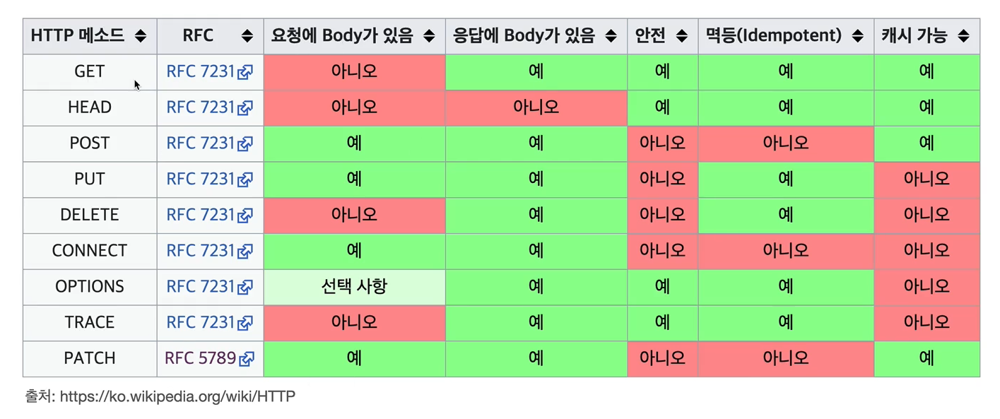

# 목차
[HTTP 웹 기본 지식](#http-웹-기본-지식)
- [2월1일](#2월1일)
  - [HTTP API를 만들어보자](#http-api를-만들어보자)
- [2월2일](#2월2일)
  - [HTTP 메서드 - GET, POST](#http-메서드---get-post)
- [2월3일](#2월3일)
  - [HTTP 메서드 - PUT, PATCH, DELETE](#http-메서드---put-patch-delete)
  - [HTTP 메서드의 속성](#http-메서드의-속성)
- [2월4일](#2월4일)
  - [클라이언트에서 서버로 데이터 전송](#클라이언트에서-서버로-데이터-전송)
- [2월5일](#2월5일)
  - [HTTP API 설계 예시](#http-api-설계-예시)
<br/>

# HTTP 웹 기본 지식
## 2월1일

## HTTP API를 만들어보자

요구사항-회원 정보 관리 API를 만들어라.
- 회원 목록 조회
- 회원 조회
- 회원 등록
- 회원 수정
- 회원 삭제

### API URI(Uniform Resource Identifier) 설계

이것은 좋은 URI 설계일까?
- 회원 목록 조회 /read-member-list
- 회원 조회 /read-member-by-id
- 회원 등록 /create-member
- 회원 수정 /update-member
- 회원 삭제 /delete-member

가장 중요한 것은 리소스 식별

### API URI(Uniform Resource Identifier) 고민
- 리소스의 의미는 뭘까?
  - 회원을 등록하고 수정하고 조회하는게 리소스가 아니다!
  - 예) 미네랄을 캐라 -> 미네랄이 리소스
  - 회원이라는 개념 자체가 바로 리소스다.
- 리소스는 어떻게 식별하는게 좋을까?
  - 회원을 등록하고 수정하고 조회하는 것을 모두 배제
  - 회원이라는 리소스만 식별하면 된다. -> 회원 리소스를 URI에 매핑

### API URI(Uniform Resource Identifier) 설계 - 리소스 식별, URI 계층 구조 활용
- 회원 목록 조회 /members
- 회원 조회 /members/{id} -> 어떻게 구분하지?
- 회원 등록 /members/{id} -> 어떻게 구분하지?
- 회원 수정 /members/{id} -> 어떻게 구분하지?
- 회원 삭제 /members/{id} -> 어떻게 구분하지?
- 참고: 계층 구조상 상위를 컬렉션으로 보고 복수단어 사용 권장(member -> members)

### 리소스와 행위를 분리 - 가장 중요한 것은 리소스를 식별하는 것
- URI는 리소스만 식별!
- 리소스와 해당 리소스를 대상으로 하는 행위를 분리
  - 리소스: 회원
  - 행위: 조회, 등록, 삭제, 변경
- 리소스는 명상, 행위는 동사 (미네랄을 캐라)
- 행위(메서드)는 어떻게 구분? HTTP 메서드 - GET, POST

## 2월2일

## HTTP 메서드 - GET, POST

### HTTP 메서드 종류 - 주요 메서드

- GET: 리소스 조회
- POST: 요청 데이터 처리, 주로 등록에 사용
- PUT: 리소스를 대체, 해당 리소스가 없으면 생성
- PATCH: 리소스 부분 변경
- DELETE: 리소스 삭제

### HTTP 메서드 종류 - 기타 메서드

- HEAD: GET과 동일하지만 메시지 부분을 제외하고, 상태 줄과 헤더만 반환
- OPTION: 대상 리소스에 대한 통신 가능 옵션(메서드)을 설명(주로 CORS에서 사용)
- CONNECT: 대상 자원으로 식별되는 서버에 대한 터널을 설정
- TRACE: 대상 리소스에 대한 경로를 따라 메시지 루프백 테스트를 수행

### GET

GET /search?q=hello&hl=ko HTTP/1.1
Host: www.google.com

- 리소스 조회
- 서버에 전달하고 싶은 데이터는 query(쿼리 파라미터, 쿼리 스트링)를 통해서 전달
- 메시지 바디를 사용해서 데이터를 전달할 수 있지만, 지원하지 않는 곳이 많아서 권장하지 않음

### GET 리소스 조회1 - 메시지 전달

클라이언트에서 서버로 GET/members/100 HTTP/1.1 Host: localhost:8080를 전달한다.

### GET 리소스 조회2 - 서버도착

서버는 받은 메시지 정보를 토대로 데이터베이스를 조회한다.

/member/100

{"username":"young", "age":20}

### GET 리소스 조회3 - 응답 데이터

서버는 응답 데이터를 만들어 클라이언트로 전달한다.

응답 데이터

```
HTTP/1.1 200 OK
Content-Type: application/json
Content-Length: 34

{
  "username":"young",
  "age":20,
  ...
}
```

### POST

```
POST /members HTTP/1.1
Content-Type: application/json

{"username":"young", "age":20}
```

- 요청 데이터 처리
- 메시지 바디를 통해 서버로 요청 데이터 전달
- 서버는 요청 데이터를 처리
  - 메시지 바디를 통해 들어온 데이터를 처리하는 모든 기능을 수행한다.
- 주로 전달된 데이터로 신규 리소스 등록, 프로세스 처리에 사용

### POST 리소스 등록1 - 메시지 전달

```
POST/members HTTP/1.1
Content-Type: application/json

{"username":"young", "age":20}
```

클라이언트에서 서버로 바디를 포함한 메시지를 전달한다.

### POST 리소스 등록2 - 신규 리소스 생성

/members/100 신규 리소스 식별자 생성

{"username":"young", "age":20}

서버에서 클라이언트로부터 전달 받은 내용을 토대로 신규 리소스 식별자 생성을 한다.

### POST 리소스 등록3 - 응답 데이터

```
HTTP/1.1 201 Created
Content-Type: application/json
Content-Length: 34
Location: /members/100

{"username":"young", "age":20}
```

서버는 클라이언트로 응답 데이터를 전달한다.

신규로 생성된 경우 보통 HTTP/ver 201 Created로 전달하는데 200으로 해도 된다.

그리고 자원이 생성된 경로인 Location도 기입하여 전달한다.

### POST 요청 데이터를 어떻게 처리한다는 뜻일까? 예시

- 스펙:POST메서드는 대상 리소스가 리소스의 고유 한 의미 체계에 따라 요청에 포함 된 표현을 처리하도록 요청합니다.(구글 번역)
- 예를 들어 POST는 다음과 같은 기능에 사용됩니다.
  - HTML 양식에 입력 된 필드와 같은 데이터 블록을 데이터 처리 프로세스에 제공
    - 예) HTML FORM에 입력한 정보로 회원 가입, 주문 등에서 사용
  - 게시판, 뉴스 그룹, 메일링 리스트, 블로그 또는 유사한 기사 그룹에 메시지 게시
    - 예) 게시판 글쓰기, 댓글 달기
  - 서버가 아직 식별하지 않은 새 리소스 생성
    - 예) 신규 주문 생성
  - 기존 자원에 데이터 추가
    - 예) 한 문서 끝에 내용 추가하기
- 정리: 이 리소스 URI에 POST 요청이 오면 요청 데이터를 어떻게 처리할지 리소스마다 따로 정해야 함 -> 정해진 것이 없다.

### POST 정리

- 1.새 리소스 생성(등록)
  - 서버가 아직 식별하지 않은 새 리소스 생성
- 2.요청 데이터 처리
  - 단순히 데이터를 생성하거나, 변경하는 것을 넘어서 프로세스를 처리해야 하는 경우
  - 예) 주문에서 결제완료 -> 배달시작 -> 배달완료 처럼 단순히 값 변경을 넘어 프로세스의 상태가 변경되는 경우
  - POST의 결과로 새로운 리소스가 생성되지 않을 수도 있음
  - 예) POST /orders/{orderld}/state-delivery (컨트롤 URI)
- 3.다른 메서드로 처리하기 애매한 경우
  - 예) JSON으로 조회 데이터를 넘겨야 하는데, GET 메서드를 사용하기 어려운 경우
  - 애매하면 POST

## 2월3일

## HTTP 메서드 - PUT, PATCH, DELETE

### PUT

```
PUT /members/100 HTTP/1.1 ***클라이언트가 리소스 식별!!(100)
Content-Type: application/json

{"username":"hello", "age":20}
```

- 리소스를 대체
  - 리소스가 있으면 대체
  - 리소스가 없으면 생성
  - 쉽게 이야기해서 덮어버림
- 중요! 클라이언트가 리소스를 식별
  - 클라이언트가 리소스 위치를 알고 URI 지정
  - POST와의 차이점이다.

### PUT 리소스가 있는 경우

```
PUT /members/100 HTTP/1.1
Content-Type: application/json

{"username":"old", "age":50}
```

서버에서 클라이언트의 메시지를 받고 members/100번에 중복되는 기존 리소스가 있다면 클라이언트에서 보내온 리소스로 덮어 버린다.

### PUT 리소스가 없는 경우

서버에서 /members/100 신규 리소스를 생성

```
{"username":"old", "age":50}
```

### PUT 주의! - 리소스를 완전히 대체한다1

(클라이언트)

```
PUT /members/100 HTTP/1.1
Content-Type: application/json

{"age":50} !username 필드 없음
```
 
(서버)

```
/members/100

{"username":"young", "age":20}

(서버) - 클라이언트 리소스로 대체

/members/100

{"age":50} - username 필드 삭제됨
```

#### 결국 PUT은 리소스를 덮어쓰기가 아닌 완전 대체라고 생각하면 된다.

그리고 파일 붙여넣기 개념을 사용하고 싶다면 PATCH를 사용하면 된다.

### PATCH

```
PATCH /members/100 HTTP/1.1
Content-Type: application/json

{"age":50}
```

- 리소스 부분 변경

! PATCH가 지원되지 않는 서버가 간혹 존재할 수 있다. 그럴경우 POST사용

### DELETE

```
DELETE /members/100 HTTP/1.1
Host: localhost:8080
```

- 리소스 제거

## HTTP 메서드의 속성

- 안전(Safe Methods)
- 멱등(Idempotent Methods)
- 캐시가능(Cacheable Methods)



### 안전 Safe

- 호출해도 리소스를 변경하지 않는다.
- Q: 그래도 계속 호출해서, 로그 같은게 쌓여서 장애가 발생하면요?
- A: 안전은 해당 리소스만 고려한다. 그런 부분까지 고려하지 않는다.

### 멱등 Idempotent

- f(f(x)) = f(x)
- 한 번 호출하든 두 번 호출하든 100번 호출하든 결과가 똑같다.
- 멱등 메서드
  - GET: 한 번 조회하든, 두 번 조회하든 같은 결과가 조회된다.
  - PUT: 결과를 대체한다. 따라서 같은 요청을 여러번 해도 최종 결과는 같다.
  - DELETE: 결과를 삭제한다. 같은 요청을 여러번 해도 삭제된 결과는 똑같다.
  - POST: 멱등이 아니다! 두 번 호출하면 같은 결제가 중복해서 발생할 수 있다. (X)

<br/>

- 활용
  - 자동 복구 메커니즘
  - 서버가 TIMEOUT 등으로 정상 응답을 못 주었을 때, 클라이언트가 같은 요청을 다시 해도 되는가? 판단 근거

<br/>
 - Q: 재요청 중간에 다른 곳에서 리소스를 변경해버리면?
  - 사용자1: GET -> username:A, age:20
  - 사용자2: PUT -> username:A, age:30
  - 사용자3: GET -> username:A, age:30 -> 사용자2의 영향으로 바뀐 데이터 조회
- A: 멱등은 외부 요인으로 중간에 리소스가 변경되는 것 까지는 고려하지는 않는다.

### 캐시가능 Cacheable

- 응답 결과 리소스를 캐시해서 사용해도 되는가?
- GET, HEAD, POST, PATCH 캐시가능
- 실제로는 GET, HEAD 정도만 캐시로 사용
  - POST, PATCH는 본문 내용까지 캐시 키로 고려해야 하는데, 구현이 쉽지 않음

## 2월4일

## 클라이언트에서 서버로 데이터 전송

- 클라이언트에서 서버로 데이터 전송
- HTTP API 설계 예시

### 클라이언트에서 서버로 데이터 전송 - 데이터 전달 방식은 크게 2가지
- 쿼리 파라미터를 통한 데이터 전송
  - GET
  - 주로 정렬 필터(검색어)
- 메시지 바디를 통한 데이터 전송
  - POST, PUT, PATCH
  - 회원 가입, 상품 주문, 리소스 등록, 리소스 변경

### 클라이언트에서 서버로 데이터 전송 - 4가지 상황
- 정적 데이터 조회
  - 이미지, 정적 텍스트 문서
- 동적 데이터 조회
  - 주로 검색, 게시판 목록에서 정렬 필터(검색어)
- HTML Form을 통한 데이터 전송
  - 회원 가입, 상품 주문, 데이터 변경
- HTTP API를 통한 데이터 전송
  - 회원 가입, 상품 주문, 데이터 변경
  - 서버 to 서버, 앱 클라이언트, 웹 클라이언트(Ajax)

### 정적 데이터 조회 - 정리
- 이미지, 정적 텍스트 문서
- 조회는 GET 사용
- 정적 데이터는 일반적으로 쿼리 파라미터 없이 리소스 경로로 단순하게 조회 가능

### 동적 데이터 조회 - 정리
- 주로 검색, 게시판 목록에서 정렬 필터(검색어)
- 조회 조건을 줄여주는 필터, 조회 결과를 정렬하는 정렬 조건에 주로 사용
- 조회는 GET 사용
- GET은 쿼리 파라미터 사용해서 데이터를 전달

### HTML Form 데이터 전송 - (POST 전송 - 저장)

웹 브라우저가 생성한 요청 HTTP 메시지

참고로 form의 method는 get으로 변경할 수 있다. POST일 경우 메시지 바디에 GET일 경우 URL경로에 담아서 전달

주의! GET은 조회에만 사용! 리소스 변경이 발생하는 곳에 사용하면 안됨!

```html
<form action="/save" method="post">
  <input type="text" name="username" />
  <input type="text" name="age" />
  <button type="submit">전송</button>
</form>
```

```
POST일 경우

POST /save HTTP/1.1
Host: localhost:8080
Content-Type: application/x-www-form-urlencoded

username=kim&age=20
```

```
GET일 경우

GET /save?username=kim&age=20 HTTP/1.1
Host: localhost:8080
```

### HTML Form 데이터 전송 - multipart/form-data

파일을 전송하기 위해서는 multipart/form-data라는 메시지 바디에 넣는 형식을 사용해야 한다.

웹 브라우저에서 boundary의---XXX를 기준으로 자동으로 잘라준다.

```html
<form action="/save" method="post" enctype="multipart/form-data">
  <input type="text" name="username" />
  <input type="text" name="age" />
  <input type="file" name="file1" />
  <button type="submit">전송</button>
</form>
```

```
POST /save HTTP/1.1
Host: localhost:8080
Content-Type: multipart/form-data; boundary=---XXX
Content-length: 10457

-----XXX
Content-DisPosition: form-data; name="username"

kim
-----XXX
Content-DisPosition: form-data; name="age"

20
-----XXX
Content-DisPosition: form-data; name="file1"; filename="intro.png"
Content-Type: image/png

109238a9o0p3eqwokjasd09ou3oirjwoe9u34ouief...
-----XXX--
```

### HTML Form 데이터 전송 - 정리
- HTML Form submit시 POST 전송
  - 예) 회원 가입, 상품 주문, 데이터 변경
- Content-Type: application/x-www-form-urlencoded 사용
  - form의 내용을 메시지 바디를 통해서 전송(key=value, 쿼리 파라미터 형식)
  - 전송 데이터를 url encoding 처리
    - 예) abc김 -> abc%EA%B9%80
- HTML Form은 GET 전송도 가능
- Content-Type: multipart/form-data
  - 파일 업로드 같은 바이너리 데이터 전송시 사용
  - 다른 종류의 여러 파일과 폼의 내용 함께 전송 가능(그래서 이름이 multipart)
- 참고: HTML Form 전송은 GET, POST만 지원

### HTTP API 데이터 전송 - 정리
- 서버 to 서버
  - 백엔드 시스템 통신
- 앱 클라이언트
  - 아이폰, 안드로이드
- 웹 클라이언트
  - HTML에서 Form 전송 대신 자바 스크립트를 통한 통신에 사용(AJAX)
  - 예) React, VueJS 같은 웹 클라이언트 API 통신
- POST, PUT, PATCH: 메시지 바디를 통해 데이터 전송
- GET: 조회, 쿼리 파라미터로 데이터 전달
- Content-Type: application/json을 주로 사용 (사실상 표준)
  - TEXT, XML, JSON 등등

## 2월5일

## HTTP API 설계 예시
- HTTP API - 컬렉션
  - POST 기반 등록
  - 예) 회원 관리 API 제공
- HTTP API - 스토어
  - PUT 기반 등록
  - 예) 정적 컨텐츠 관리, 원격 파일 관리
- HTML FORM 사용
  - 웹 페이지 회원 관리
  - GET, POST만 지원

### 회원 관리 시스템 API 설계 - POST 기반 등록
- 회원 목록 /members -> GET
- 회원 등록 /members -> POST
- 회원 조회 /members/{id} -> GET
- 회원 수정 /members/{id} -> PATCH, PUT, POST
- 회원 삭제 /members/{id} -> DELETE

### 회원 관리 시스템 POST - 신규 자원 등록 특징
- 클라이언트는 등록될 리소스의 URI를 모른다.
  - 회원 등록 /members -> POST
  - POST /members
- 서버가 새로 등록된 리소스 URI를 생성해준다.
  - HTTP/1.1 201 Created Location: /members/100
- 컬렉션(Collection)
  - 서버가 관리하는 리소스 디렉토리
  - 서버가 리소스의 URI를 생성하고 관리
  - 여기서 컬렉션은 /members

### 파일 관리 시스템 API 설계 - PUT 기반 등록
- 파일 목록 /files -> GET
- 파일 조회 /files/{filename} -> GET
- 파일 등록 /files/{filename} -> PUT
- 파일 삭제 /files/{filename} -> DELETE
- 파일 대량 등록 /files -> POST

### 파일 관리 시스템 PUT - 신규 자원 등록 특징
- 클라이언트가 리소스 URI를 알고 있어야 한다.
  - 파일 등록 /files/{filename} -> PUT
  - PUT /files/star.jpg
- 클라이언트가 직접 리소스의 URI를 지정한다.
- 스토어(Store)
  - 클라이언트가 관리하는 리소스 저장소
  - 클라이언트가 리소스의 URI를 알고 관리
  - 여기서 스토어는 /files

#### !! 대부분 POST기반의 신규 자원 등록을 사용한다.

### HTML FORM 사용
- HTML FORM은 GET, POST만 지원
- AJAX 같은 기술을 사용해서 해결 가능 -> 회원 API 참고
- 여기서는 순수 HTML, HTML FORM 이야기
- GET, POST만 지원하므로 제약이 있음

<br/>

- 회원 목록 /members -> GET
- 회원 등록 폼 /members/new -> GET
- 회원 등록 /members/new, /members -> POST
- 회원 조회 /members/{id} -> GET
- 회원 수정 폼 /members/{id}/edit -> GET
- 회원 수정 /members/{id}/edit, /members/{id} -> POST
- 회원 삭제 /members/{id}/delete -> POST

<br/>

- HTML FORM은 GET, POST만 지원
- 컨트롤 URI
  - GET, POST만 지원하므로 제약이 있음
  - 이런 제약을 해결하기 위해 동사로 된 리소스 경로 사용
  - POST의 /new, /edit, /delete가 컨트롤 URI
  - HTTP 메서드로 해결하기 애매한 경우 사용(HTTP API 포함)

### 정리
- HTTP API - 컬렉션
  - POST 기반 등록
  - 서버가 리소스 URI 결정
- HTTP API - 스토어
  - PUT 기반 등록
  - 클라이언트가 리소스 URI 결정
- HTML FORM 사용
  - 순수 HTML + HTML form 사용
  - GET, POST만 지원

### 정리 - 참고하면 좋은 URI 설계 개념
- 문서(document)
  - 단일 개념(파일 하나, 객체 인스턴스, 데이터베이스 row)
  - 예) /members/100, /files/star.jpg
- 컬렉션(collection)
  - 서버가 관리하는 리소스 디렉터리
  - 서버가 리소스의 URI를 생성하고 관리
  - 예) /members
- 스토어(store)
  - 클라이언트가 관리하는 자원 저장소
  - 클라이언트가 리소스의 URI를 알고 관리
  - 예) /files
- 컨트롤러(controller), 컨트롤 URI
  - 문서, 컬렉션, 스토어로 해결하기 어려운 추가 프로세스 실행
  - 동사를 직접 사용
  - 예) /members/{id}/delete
- [참고 사이트](https://restfulapi.net/resource-naming/)