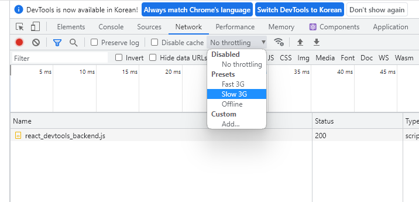

- [3월7일](#3월7일)
- [3월8일](#3월8일)
- [3월9일](#3월9일)
- [3월10일](#3월10일)
- [3월11일](#3월11일)
  - [React 객체관리 및 스프레스 연산자 적용법](#react-객체관리-및-스프레스-연산자-적용법)
- [3월13일](#3월13일)
- [3월14일](#3월14일)
  - [Form을 만드는법](#form을-만드는법)
- [3월16일](#3월16일)
  - [컴포넌트의 재사용](#컴포넌트의-재사용)
- [3월21일](#3월21일)
  - [최적화 useMemo, useCallback](#최적화-usememo-usecallback)
  - [에러 처리](#에러-처리)
  - [커스텀 Hooks 만들기](#커스텀-hooks-만들기)
  - [클래스 컴포넌트](#클래스-컴포넌트)
- [3월28일](#3월28일)

# 3월7일
[React 개발 기본 셋팅 정리](https://velog.io/@wonxx777/React-%EA%B0%9C%EB%B0%9C-%EA%B8%B0%EB%B3%B8-%EC%85%8B%ED%8C%85)

[React 기초 정리](https://velog.io/@wonxx777/React-%EA%B8%B0%EC%B4%88)

# 3월8일
[React CSR과 JSX](https://velog.io/@wonxx777/React-CSR%EA%B3%BC-JSX)

[React 컴포넌트 기초](https://velog.io/@wonxx777/React-%EC%BB%B4%ED%8F%AC%EB%84%8C%ED%8A%B8-%EA%B8%B0%EC%B4%88)

[React Props 연습 - 신입 개발자 표기](https://velog.io/@wonxx777/React-Props-%EC%97%B0%EC%8A%B5-%EC%8B%A0%EC%9E%85-%EA%B0%9C%EB%B0%9C%EC%9E%90-%ED%91%9C%EA%B8%B0)

# 3월9일
[React Props 연습 - 컴포넌트 분리하기](https://velog.io/@wonxx777/React-Props-%EC%97%B0%EC%8A%B5-%EC%BB%B4%ED%8F%AC%EB%84%8C%ED%8A%B8-%EB%B6%84%EB%A6%AC%ED%95%98%EA%B8%B0)

[React event 처리](https://velog.io/@wonxx777/React-event-%EC%B2%98%EB%A6%AC)

[React - 상태관리 State](https://velog.io/@wonxx777/React-%EC%83%81%ED%83%9C%EA%B4%80%EB%A6%AC-State)

# 3월10일
[React useState 연습 - total count 만들기](https://velog.io/@wonxx777/React-useState-%EC%97%B0%EC%8A%B5-total-count-%EB%A7%8C%EB%93%A4%EA%B8%B0)

[React useEffect 생애주기(생명주기)](https://velog.io/@wonxx777/React-useEffect-%EC%83%9D%EC%95%A0%EC%A3%BC%EA%B8%B0%EC%83%9D%EB%AA%85%EC%A3%BC%EA%B8%B0)

# 3월11일
## React 객체관리 및 스프레스 연산자 적용법

```jsx
import { useState } from "react"

export default function Food() {
  const [food, setFood] = useState({
    time: '저녁',
    type: {
      food_type: '양식',
      food_name: '파스타'
    }
  });
  return (
    <>
      <h1>오늘의 {food.time}은?</h1>

      <p>오늘의 저녁은 {food.type.food_type} {food.type.food_name} 입니다.</p>

      <button onClick={() => {
        const name = prompt('변경할 음식 종류를 입력해주세요');
        // 중첩 객체일 경우 ...prev.type 형태로 기입해야 한다.
        setFood(prev => ({...prev, type: {...prev.type, food_type: name}}));
      }}>음식 종류 바꾸기</button>

      <button onClick={() => {
        const test = prompt('변경할 음식을 입력해주세요');
        setFood(prev => ({...prev, type: {...prev.type, food_name: test}}))
      }}>음식 바꾸기</button>
    </>
  )
}
```

```jsx
// 스프레드 연산자를 통해 이전 prev객체를 덮어씌운 후 type를 다시 덮어씌운다.
setFood(prev => ({...prev, type: {...prev.type, food_type: name}}));

// type객체를 덮어 씌운 후 이전 prev객체를 다시 덮어씌운다. 즉 값의 변경이 일어나지 않는다.
setFood(prev => ({type: {...prev.type, food_type: name}, ...prev}));
```

# 3월13일
강의 저작권 문제로 비공개

[React 연습 - 배열 상태 관리(멘토 수정)](https://velog.io/@wonxx777/React-%EC%97%B0%EC%8A%B5-%EB%B0%B0%EC%97%B4-%EC%83%81%ED%83%9C-%EA%B4%80%EB%A6%AC)

[React 연습 - 배열 상태 관리(멘토 추가, 삭제)](https://velog.io/@wonxx777/React-%EC%97%B0%EC%8A%B5-%EB%B0%B0%EC%97%B4-%EC%83%81%ED%83%9C-%EA%B4%80%EB%A6%AC%EB%A9%98%ED%86%A0-%EC%B6%94%EA%B0%80-%EC%82%AD%EC%A0%9C)


# 3월14일

[React useReducer - 컴포넌트 재사용](https://velog.io/@wonxx777/React-useReducer-%EC%BB%B4%ED%8F%AC%EB%84%8C%ED%8A%B8-%EC%9E%AC%EC%82%AC%EC%9A%A9)

[React 라이브러리 Immer](https://velog.io/@wonxx777/React-%EB%9D%BC%EC%9D%B4%EB%B8%8C%EB%9F%AC%EB%A6%AC-Immer)

## Form을 만드는법
React에서는 uncontrolled component를 controlled component로 바꿔주는 것이 좋다. 

```jsx
import React, { useState } from "react";

export default function AppForm() {
  // uncontrolled component를 해결하려면 상태관리를 해주면 된다.
  const [form, setForm] = useState(
    {
      name: '',
      email: ''
    }
  );

  const handleChange = (e) => {
    // e.target의 name, value 속성의 값을 가져온다.
    const {name, value} = e.target;
    console.log(name)
    console.log(value)
    setForm({...form, [name]: value})
  }

  const handleSubmit = (e) => {
    // e.preventDefault();를 하지 않으면 onSubmit가 발생했을때  페이지가 리프레쉬 된다.
    e.preventDefault();
  };

  return (
    // React에서 상태변경이 일어나지 않아도 UI상에 변화가 생기는 컴포넌트를 uncontrolled component(통제되지 않는 컴포넌트)라고 한다.
    <form onSubmit={handleSubmit}>
      <label htmlFor="name">이름:</label>
      <input type="text" id="name" name="name" value={form.name} onChange={handleChange} />
      <label htmlFor="email">이메일:</label>
      <input type="text" id="email" name="email" value={form.email} onChange={handleChange} />
      <button>Submit</button>
    </form>
  )
}
```

# 3월16일
## 컴포넌트의 재사용
자식들을 감싸는 wrapper컴포넌트를 하나 만드는 것이 좋다. 이 wrapper컴포넌트에는 공통적인 레이아웃만 설정한다. ex) padding, margin, background

# 3월21일
## 최적화 useMemo, useCallback
useMemo은 Memoization된 함수의 반환 '값'을 반환하는 함수이다.
```jsx
const result = useMemo(() => calculateSomething(), []);

function calculateSomething() {
  for (let i = 0; i < 10000; i++) {
    console.log('😆');
  }
  return 10;
}
```

useCallback은 Memoization된 '함수'를 반환하는 함수이다.
```jsx
const handleUpdate = useCallback(() => {
  const prev = prompt(`누구의 이름을 바꾸고 싶은가요?`);
  const current = prompt(`이름을 무엇으로 바꾸고 싶은가요?`);
  dispatch({ type: 'updated', prev, current });
}, []);
```

## 에러 처리



위처럼 네트워크 속도를 조절할 수 있다.(로딩페이지 테스트)

하지만 개발자 도구 켜놓고 테스트 해야된다.

```jsx
import React, { useEffect, useState } from 'react';

export default function Products() {
  // 로딩중일때 상태
  const [loading, setLoading] = useState(false);
  // 에러일떄 상태
  const [error, setError] = useState();
  const [products, setProducts] = useState([]);
  const [checked, setChecked] = useState(false);
  const handleChange = () => setChecked((prev) => !prev);

  useEffect(() => {
    setLoading(true);
    setError(undefined);
    fetch(`data/${checked ? 'sale_' : ''}d.json`)
      .then((res) => res.json())
      .then((data) => {
        console.log('🔥뜨끈한 데이터를 네트워크에서 받아옴');
        setProducts(data);
      })
      // catch는 에러일 경우
      .catch(() => setError('Error!'))
      // finally를 네트워크 통신을 끝냈을때
      .finally(() => setLoading(false));
    return () => {
      console.log('🧹 깨끗하게 청소하는 일들을 합니다.');
    };
  }, [checked]);

  if(loading) return <p>Loading...</p>
  if(error) return <p>{error}</p>

  return (
    <>
      <input
        id='checkbox'
        type='checkbox'
        value={checked}
        onChange={handleChange}
      />
      <label htmlFor='checkbox'>Show Only 🔥 Sale</label>
      <ul>
        {products.map((product) => (
          <li key={product.id}>
            <article>
              <h3>{product.name}</h3>
              <p>{product.price}</p>
            </article>
          </li>
        ))}
      </ul>
    </>
  );
}
```

## 커스텀 Hooks 만들기

```jsx
// use-products.jsx
import { useEffect, useState } from 'react';

// 커스텀 훅은 외부와 공유하고 싶은 데이터를 return한다. (ui컴포넌트가 xml을 return하는 것과 다른 점)
// hooks폴더를 따로 만들고 안에 넣었음
export default function useProducts({salesOnly}) {
  const [loading, setLoading] = useState(false);
  const [error, setError] = useState();
  const [products, setProducts] = useState([]);

  useEffect(() => {
    setLoading(true);
    setError(undefined);
    fetch(`data/${salesOnly ? 'sale_' : ''}products.json`)
      .then((res) => res.json())
      .then((data) => {
        console.log('🔥뜨끈한 데이터를 네트워크에서 받아옴');
        setProducts(data);
      })
      .catch(() => setError('Error!'))
      .finally(() => setLoading(false));
    return () => {
      console.log('🧹 깨끗하게 청소하는 일들을 합니다.');
    };
  }, [salesOnly]);

  return [loading, error, products]
}

// Hooks은 (함수들은) 값의 재사용이 아니라 로직의 재사용을 위한 것이다.
// 호출한 곳마다 개별적인 상태를 가진다.
```

```jsx
// use-products 사용
import React, { useState } from 'react';
import useProducts from '../../hooks/use-products';

export default function Products() {
  const [checked, setChecked] = useState(false);
  const [loading, error, products] = useProducts({salesOnly: checked});
  const handleChange = () => setChecked((prev) => !prev);

  if(loading) return <p>Loading...</p>
  if(error) return <p>{error}</p>

  return (
    <>
      <input
        id='checkbox'
        type='checkbox'
        value={checked}
        onChange={handleChange}
      />
      <label htmlFor='checkbox'>Show Only 🔥 Sale</label>
      <ul>
        {products.map((product) => (
          <li key={product.id}>
            <article>
              <h3>{product.name}</h3>
              <p>{product.price}</p>
            </article>
          </li>
        ))}
      </ul>
    </>
  );
}
```

## 클래스 컴포넌트
함수형 컴포넌트가 나오기 이전에는 클래스로 컴포넌트를 만들었다.

```jsx
import React from 'react';
import Counter from './basic/components/Counter';
// 클래스 컴포넌트의 장점: 
// 함수형 컴포넌트는 상태가 변할때마다 함수 전체를 호출하므로 최적화 작업을 해야 한다. 
// 하지만 클래스 컴포넌트는 맴버함수로 정의되어 있기 때문에 상태가 변경될때마다 render함수만 호출된다. Hooks을 통해 별도의 최적화를 하지 않아도 된다.

// React.Component를 꼭 상속해야 한다.
// 클래스 컴포넌트는 this를 통해 접근한다.
export default class AppClass extends React.Component {
  // 맴버변수에 객체 할당
  state = { count: 0 };

  // 맴버함수를 통해 클릭이 발생할때 상태변화
  onClick = () => {
    this.setState({ count: this.state.count + 1 });
  };

  // useEffect처럼 컴포넌트가 처음 보여질때
  componentDidMount() {
    console.log('컴포넌트가 마운트 되었음!');
  }

  // useEffect의 콜백함수처럼 컴포넌트가 사라질때
  componentWillUnmount() {
    console.log('컴포넌트가 곧 언마운트될 예정임!');
  }

  // render맴버 함수를 통해 UI컴포넌트 return
  render() {
    return (
      <div className='container'>
        <div className='banner'>
          Total Count: {this.state.count} {this.state.count > 10 ? '🔥' : '❄️'}
        </div>
        <div className='counters'>
          <Counter total={this.state.count} onClick={this.onClick} />
          <Counter total={this.state.count} onClick={this.onClick} />
        </div>
      </div>
    );
  }
}
```

# 3월28일
[React Router](https://velog.io/@wonxx777/React-Router)