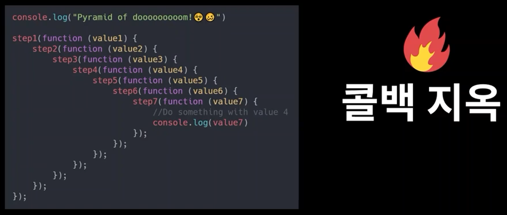
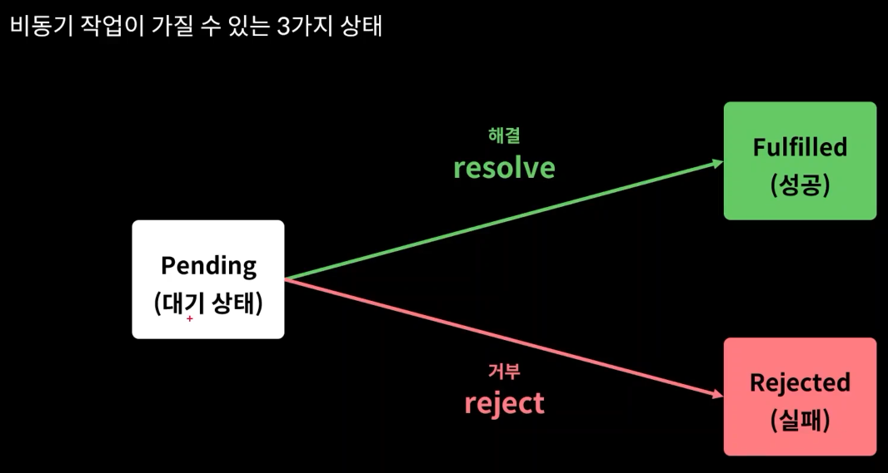
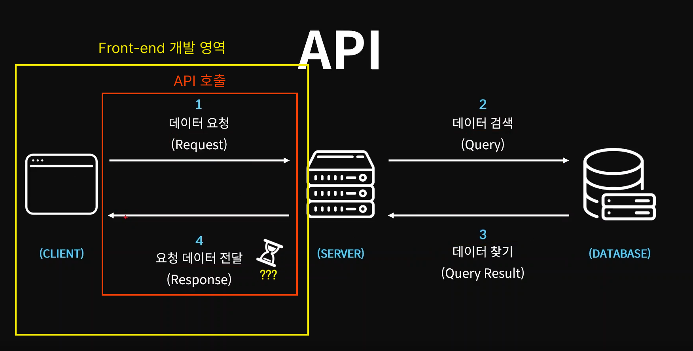
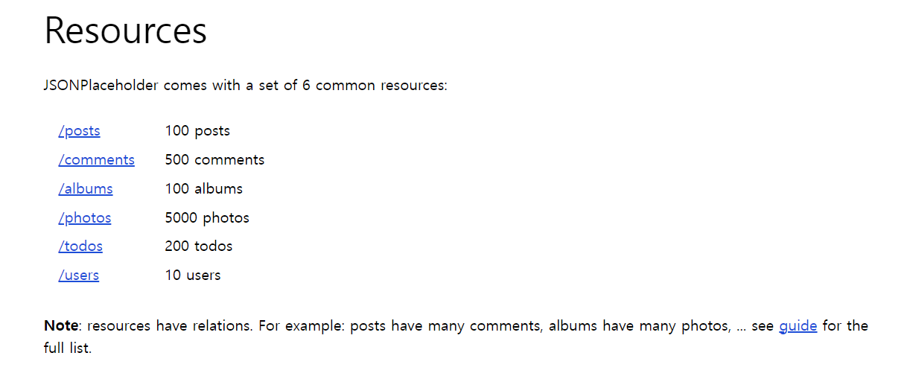
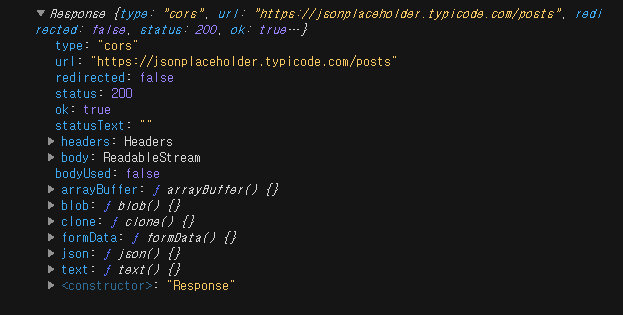
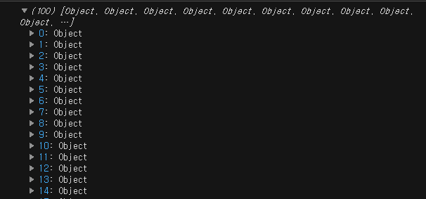

[단락회로 평가](#단락회로-평가)<br/>
[조건문 Upgrade](#조건문-upgrade)<br/>
[비 구조화 할당 or 구조 분해 할당](#비-구조화-할당-or-구조-분해-할당)<br/>
[Spread Operator (전개 연산자)](#spread-operator-전개-연산자)<br/>
[동기 & 비동기](#동기--비동기)<br/>
[Promise - 콜백지옥에서 탈출하기](#promise---콜백지옥에서-탈출하기)<br/>
[async & await - 직관적인 비 동기 처리 코드 작성하기](#async--await---직관적인-비-동기-처리-코드-작성하기)<br/>
[API 호출하기](#api--fetch)<br/>

# 단락회로 평가
### 단락회로 평가란 논리연산자의 왼쪽에서 오른쪽으로 연산하게 되는 연산순서를 이용한 문법이다.
### 더 자세히 말하면 앞에 위치한 피연산자로 인해 평가 결과가 확정됐을 경우 뒤에 위치한 피연산자를 확인할 필요 없이 연산을 끝내버리는 것을 단락회로 평가라 한다.
<br/>

```js
// AND
// 앞에 위치한 피연산자 값이 false라면 뒤에 위치한 피연산자를 확인할 필요 없이 연산을 끝내고 false를 출력한다.
console.log(false && true); // false

// OR
// 하나의 피연산자 값이 true일 경우라도 true를 반환하기 때문에 앞에 위치한 피연산자 값이 true일 경우 연산을 끝내고 true를 반환한다.  
console.log(true || false); // true

// NOT
console.log(!true); // false
```
<br/>

- ### Truthy Falsy 개념을 통한 단락회로 평가 활용
<br/>

```js
// 예제 1-1
// !person은 Falsy 개념을 통해 null과 undefined인지 확인할 수 있었다.
const getName = (person) => {
  if (!person) {
    return "객체가 아닙니다.";
  }
  return person.name;
};

let person;
const name = getName(person);
console.log(name); // 객체가 아닙니다

// 예제 1-2
// person && person.name의 경우 Falsy 개념을 통해 단락회로 평가를 활용한 예제다. 논리연산자 &&는 앞의 피연산자 값이 flase일 경우 그대로 연산을 끝내고 false를 반환하기 때문에 person.name에 값이 없을 경우 falsy개념에 해당하므로 undefined나 null이 할당 됐다면 null을 반환한다.
const getName = (person) => {
  return person && person.name;
};

let person;
const name = getName(person);
console.log(name); // undefined

// 예제 1-3
// 예제 1-2에서는 person의 값이 Falsy일 경우 그에 해당하는 값이 출력 됐다면 이번에는 "객체가 아닙니다"를 반환한다.
// 논리연산사 ||는 앞의 피연산자 값이 true일 경우 그대로 연산을 끝내고 true를 반환한다. 즉 name에 person.name가 할당되어 있을 경우 Truthy에 해당하므로 name을 반환하고 만약 Falsy한 값이 할당 되어 있을 경우 ||연산자는 뒤의 Truthy한 값을 찾아야 하기 때문에 Truthy에 해당하는 "객체가 아닙니다"를 반환한다.
const getName = (person) => {
  const name = person && person.name;
  return name || "객체가 아닙니다";
};

let person;
const name = getName(person);
console.log(name); // 객체가 아닙니다
```
<br/>

# 조건문 Upgrade
```js
// 예제 1-1
function isKoreanFood(food) {
  if (food === "불고기" || food === "비빔밥" || food === "떡볶이") {
    return true;
  }
  return false;
}

// food1은 조건을 만족하기 때문에 true를 반환한다.
const food1 = isKoreanFood("불고기");
// food2은 조건을 만족하기 않기 때문에 false를 반환한다.
const food2 = isKoreanFood("파스타");
console.log(food1); // true
console.log(food2); // false

// 예제 1-2
// 예제 1-1의 경우 조건이 늘어난다면 코드가 길어지게 될 것이다. 아래와 같이 배열 내장함수 includes를 활용하면 코드를 보다 간결하게 작성할 수 있다.
function isKoreanFood(food) {
  if (["불고기", "비빔밥", "떡볶이"].includes(food)) {
    return true;
  }
  return false;
}

const food1 = isKoreanFood("불고기");
const food2 = isKoreanFood("파스타");
console.log(food1); // true
console.log(food2); // false

// 예제 2-1
const getMeal = (mealType) => {
  if (mealType === "한식") return "불고기";
  if (mealType === "양식") return "파스타";
  if (mealType === "중식") return "멘보샤";
  if (mealType === "일식") return "초밥";
  return "굶기";
};

console.log(getMeal("한식")); // 불고기
console.log(getMeal("중식")); // 멘보샤
console.log(getMeal()); // 굶기

// 예제 2-2
// 만약 예제 2-1의 코드에서 식사의 유형이 계속 늘어난다면 굉장히 끔찍해질 수 있다. 이를 해결하기 위해 아래와 같이 meal 객체에 괄호표기법을 활용하여 mealType의 값이 객체 meal의 key값과 일치한다면 true이므로 해당 key값의 value값을 반환하고 아닐경우 true에 해당하는 뒤에 위치한 피연산자 "굶기"를 반환한다. 
const meal = {
  한식: "불고기",
  중식: "멘보샤",
  일식: "초밥",
  양식: "스테이크",
  인도식: "카레"
};

const getMeal = (mealType) => {
  return meal[mealType] || "굶기";
};

console.log(getMeal("한식")); // 불고기
console.log(getMeal()); // 굶기
```
<br/>

# 비 구조화 할당 or 구조 분해 할당
### 비구조화할당이란 배열이나 객체의 속성 혹은 값을 해체하여 그 값을 변수에 각각 담아 사용하는 자바스크립트 표현식이다.
```js
// 배열의 비 구조화 할당

// 예제 1-1
let arr = ["one", "two", "three"];

let one = arr[0];
let two = arr[1];
let three = arr[2];

console.log(one, two, three); // one two three

// 예제 1-2
// 예제 1-1의 경우 반복되는 코드가 있는데 아래와 같이 (배열의 기본변수 비 구조화 할당)을 통해 코드를 단축 시킬 수 있다.
let arr = ["one", "two", "three"];

let [one, two, three] = arr;
console.log(one, two, three); // one two three

// 예제 1-3
// 예제 1-2를 더 단축시킨 코드다. (배열의 선언 분리 비 구조화 할당)
let [one, two, three] = ["one", "two", "three"];
console.log(one, two, three); // one two three

// 예제 2-1
// 만약 변수에 값을 할당 받지 못하면 undefined를 할당 받게 된다.
let [one, two, three, four] = ["one", "two", "three"];
console.log(one, two, three, four); // one two three undefined

// 예제 2-2
// 만약 undefined가 반환되면 안되는 상황이라면 아래와 같이 기본값을 할당 할 수 있다.
let [one, two, three, four = "four"] = ["one", "two", "three"];
console.log(one, two, three, four); // one two three four

// 예제 3-1
// 비 구조화 할당을 활용해 두 변수의 값을 서로 스왑할 수 있다. 배열 a, b의 0번 index는 b에 1번 index는 a에 할당된다.
let a = 10;
let b = 20;

[a, b] = [b, a];
console.log(a, b); // 20 10
```
```js
// 객체의 비 구조화 할당

// 예제 1-1
let object = { one: "one", two: "two", three: "three" };

let one = object.one;
let two = object.two;
let three = object.three;

console.log(one, two, three); // one two three

// 예제 1-2
// 객체는 배열과 다르게 index번호가 아닌 key값으로 전달해야 한다. 즉 객체를 비 구조화 할당을 하기 위해서는 아래와 같이 변수에 key값을 명시해야 한다.
let object = { one: "one", two: "two", three: "three" };

let { one, two, three } = object;

console.log(one, two, three); // one two three

// 예제 1-3
// key값을 기준으로 값을 가져오기 때문에 변수의 순서는 상관 없다.
let object = { one: "one", two: "two", three: "three", name: "wyw" };

let { name, one, two, three } = object;

console.log(one, two, three, name); // one two three wyw

// 예제 1-4
// 만약 변수의 이름을 key값이 아닌 다른 이름으로 명시하고 싶다면 아래와 같이 key: value형태로 명시하면 된다.
let object = { one: "one", two: "two", three: "three", name: "wyw" };

let { name: myName, one, two, three } = object;

console.log(one, two, three, myName); // one two three wyw

// 예제 2-1
// 객체 역시 배열과 마찬가지로 기본값을 할당해 줄 수 있다.
let object = { one: "one", two: "two", three: "three", name: "wyw" };

let { name: myName, one, two, three, abc = "four" } = object;

console.log(one, two, three, myName, abc); // one two three wyw four 
```
<br/>

# Spread Operator (전개 연산자)
### 스프레드 연산자를 사용하면 배열, 문자열, 객체 등 반복 가능한 객체 (Iterable Object)를 개별 요소로 분리할 수 있다.
```js
// 객체에 스프레드 연산자 활용

// 예제 1-1
// cookie의 종류들을 나타낸 객체 데이터들이다. 자세히 보면 base와 madeIn이 전부 일치하는 것을 확인 할 수 있다.
const cookie = {
  base: "cookie",
  madeIn: "korea"
};

const chocochipCookie = {
  base: "cookie",
  madeIn: "korea",
  toping: "chocochip"
};

const blueberryCookie = {
  base: "cookie",
  madeIn: "korea",
  toping: "blueberry"
};

const strawberryCookie = {
  base: "cookie",
  madeIn: "korea",
  toping: "strawberry"
};

// 예제 1-2
// 아래와 같이 전개 연산자를 사용하여 cookie객체의 프로퍼티를 다른 객체에 펼칠 수 있다. 
const cookie = {
  base: "cookie",
  madeIn: "korea"
};

const chocochipCookie = {
  ...cookie,
  toping: "chocochip"
};

const blueberryCookie = {
  ...cookie,
  toping: "blueberry"
};

const strawberryCookie = {
  ...cookie,
  toping: "strawberry"
};

console.log(chocochipCookie); // {base: "cookie", madeIn: "korea", toping: "chocochip"}
console.log(blueberryCookie); // {base: "cookie", madeIn: "korea", toping: "blueberry"}
console.log(strawberryCookie); // {base: "cookie", madeIn: "korea", toping: "strawberry"}
```
```js
// 배열에 스프레드 연산자 활용) Tip. concat()메서드와 비교해서 더 효율적인 방법을 사용할 것!

// 예제 1-1
// 아래와 같이 전개 연산자를 사용하여 배열의 원소들을 순서대로 펼칠 수 있다. 또한 concat() 메서드와 달리 중간에 값을 넣을 수도 있다. 
const noTopingCookies = ["촉촉한쿠키", "안촉촉한쿠키"];
const topingCookies = ["바나나쿠키", "블루베리쿠키", "딸기쿠키", "초코칩쿠키"];

const allCookies = [...noTopingCookies, "함정쿠키", ...topingCookies];
console.log(allCookies); // ["촉촉한쿠키", "안촉촉한쿠키", "함정쿠키", "바나나쿠키", "블루베리쿠키", "딸기쿠키", "초코칩쿠키"]
```
<br/>

# 동기 & 비동기
### 자바스크립트에서는 코드가 작성된 순서대로 작업을 처리하며 그 연산과정을 수행하는 주체를 쓰레드라고 한다. 그리고 자바스크립트에서 순서대로 작업을 처리하는 과정. 즉 이전 작업이 진행 중 일 때는 다음 작업을 수행하지 않고 기다리는 방식을 동기적 방식이라고 부른다.
<br/>
<center></center>
<br/>

### 동기적 처리의 단점은 하나의 작업이 너무 오래 걸리게 될 시, 그 오래 걸리는 하나의 작업이 종료되기 전 까지 모든 작업이 동작하지 않기 때문에 전반적인 흐름이 느려진다.
<br/>
<center></center>
<br/>

### 이를 해결하기 위해서는 쓰레드를 여러 개 사용하는 방식인 멀티 쓰레드(MultiThread)가 있다. 오래 걸리는 작업들을 각각의 쓰레드에게 분할해서 실행시키고 나중에 결과 값을 모아보면 해결할 수 있다.
<br/>
<center></center>
<br/>

### 하지만 안타깝게도 자바스크립트는 하나의 쓰레드만 사용하는 싱글 쓰레드로 동작한다.
<br/>
<center></center>
<br/>

### 싱글쓰레드 환경에서 동기적 작업의 단점을 극복하기 위해서는 여러개의 작업을 동시에 실행시키는 즉, 먼저 작성된 코드의 결과를 기다리지 않고 다음 코드를 바로 실행시키는 비동기 작업이 있다. 또한 하나의 작업이 쓰레드를 점유하지 않는 즉, 하나의 작업을 수행할때 쓰레드가 다른 작업을 하지 못하도록 블로킹 하지 않는 방식을 논 블로킹 방식이라고 한다.
<br/>
<center></center>
<br/>

### 비동식 방식으로 작업을 했을때 작업들이 정상적으로 끝났는지 확인하기 위해서는 A, B, C 함수가 있다고 가정하고 각 함수에 작업이 끝나면 실행할 콜백함수를 붙여주면 된다.
<br/>
<center></center>
<br/>

```js
// 동기 & 비동기

// 예제 1-1(동기적 방식)
// taskA함수를 호출하게 되면 아래와 같이 "A 작업 끝" 이후에 "코드 끝"이 실행된다.
function taskA() {
  console.log("A 작업 끝");
}
taskA();
console.log("코드 끝");
// A 작업 끝
// 코드 끝
===============================================================
// 예제 2-1(비동기적 방식)
// 내장 비동기 함수인 setTimeout을 사용해본다. setTimeout의 첫번째 파라미터는 콜백함수 두번째는 딜레이 타임을 넣을 수 있다. 단위는 밀리세컨드로 1000ms === 1s이다.
// 아래와 같이 실행하면 2초 뒤에 "A TASK END"가 실행 되므로 "코드 끝"이 먼저 실행된다.
function taskA() {
  setTimeout(() => {
    console.log("A TASK END");
  }, 2000);
}
taskA();
console.log("코드 끝");
// 코드 끝
// A TASK END
===============================================================
// 예제 2-2(비동기적 방식)
// 아래와 같이 a, b파라미터를 받아와 더하여 출력하는데 3초 이후에 실행되므로 "코드 끝" 이후에 5가 실행된다.
function taskA(a, b) {
  setTimeout(() => {
    const res = a + b;
    console.log(res);
  }, 3000);
}
taskA(2, 3);
console.log("코드 끝");
// 코드 끝
// 5
===============================================================
// 예제 2-3(비동기적 방식)
// 지역 상수인 res를 밖으로 꺼내 사용하기 위해서는 콜백함수를 사용하면 된다. 
// res 매개변수를 가진 콜백함수를 callBack 매개변수에 할당하고 setTimeout() 내부에서 callBack함수를 호출하는데 인수로는 console.log("A TASK END", 5) 를 담고 3초 뒤에 출력된다.
function taskA(a, b, callBack) {
  setTimeout(() => {
    const res = a + b;
    callBack(res);
  }, 3000);
}
taskA(2, 3, (res) => {
  console.log("A TASK END", res);
});
console.log("코드 끝");
// 코드 끝
// A TASK END 5
===============================================================
// 예제 2-4(비동기적 방식)
// 2-3예제를 업그레이드해서 taskB와 taskC까지 출력하는 예제다. "코드 끝" -> taskB -> taskC -> taskA 순으로 출력되는 것을 확인할 수 있다.
function taskA(a, b, callBack) {
  setTimeout(() => {
    const res = a + b;
    callBack(res);
  }, 3000);
}

function taskB(a, callBack) {
  setTimeout(() => {
    const res = a * 2;
    callBack(res);
  }, 1000);
}

function taskC(a, callBack) {
  setTimeout(() => {
    const res = a * -1;
    callBack(res);
  }, 2000);
}

taskA(2, 3, (res) => {
  console.log("A TASK END", res);
});
taskB(7, (res) => {
  console.log("B TASK RESULT", res);
});
taskC(14, (res) => {
  console.log("C TASK RESULT", res);
});
console.log("코드 끝");
//코드 끝 
//B TASK RESULT 14
//C TASK RESULT -14
//A TASK END 5
```
<br/>

### 자바스크립트 엔진이 어떻게 동기적인 코드와 비동기적인 코드를 구분해서 사용하는지 알아보자. 자바스크립트 엔진은 Heap 그리고 Call Stack 두 가지 구성요소로 이루어져 있다. Heap는 변수나 상수들에 사용되는 메모리를 저장하는 영역이고 *Call Stack은 우리가 작성한 코드의 실행에 따라서 호출 스택을 쌓는 영역이다.
<br/>
<center></center>
<br/>

### 아래 코드의 실행 흐름을 통해 자바스크립트 엔진이 구동하는 방식을 알아보자. 자바스크립트의 코드의 실행이 시작되면 아래 Call Stack에 보이는 것처럼 자바스크립트 코드들의 가장 최상위 문맥인 Main Context가 Call Stack에 가장 먼저 들어오게 된다. 그렇기 때문에 Main Context가 Call Stack에 들어오는 순간이 바로 프로그램 실행 순간인 것이고 이 Main Context가 Call Stack에서 나가는 순간은 바로 프로그램이 종료 되는 순간이다.
<br/>
<center></center>
<br/>

### 그리고 나서 아래처럼 바로 첫번째 코드가 실행된다. 근데 function one과 two와 three는 함수 생성이기 때문에 생성만 하고 넘어간다고 생각하면 된다. 그래서 실질적으로 실행되는 부분은 console.log(three()); 가 된다. 그리고 console.log 안에서 three()라는 함수를 실행하게 되므로 이 three() 함수가 Call Stack에 추가되게 된다. 왜냐하면 three()라는 함수를 실행해야 결과 값을 리턴 받아서 콘솔에 찍어서 사용할 수 있기 때문이다.
<br/>
<center></center>
<br/>

### 그 다음에는 three() 함수를 실행시켜서 결과 값을 받아야 하기 때문에 결과 값에 있는 two() 함수도 실행 시켜야 한다. 
<br/>
<center></center>
<br/>

### 그리고 two() 함수의 결과 값을 받으려면 one() 함수도 실행시켜야 하므로 Call Stack에는 one() 함수까지 쌓이게 된다.
<br/>
<center></center>
<br/>

### one() 함수까지 들어가게 되면 결과 값 1을 리턴하고 종료되는 것을 확인할 수 있다. Call Stack에서는 종료되는 함수는 바로바로 제거 된다. Call Stack에서 사용되는 스택이라는 구조는 가장 나중에 들어온 것부터 가장 먼저 제거 되는 구조다. 그래서 가장 마지막에 호출된 one()이라는 함수가 가장 먼저 종료되고 제거되는 것을 확인할 수 있다. 
<br/>
<center></center>
<br/>

### Call Stack에서 one() 함수가 제거된 이후에 two() 함수가 one() + 1 즉, 2를 리턴하고 종료되어 Call Stack에서 제거되는 것을 확인할 수 있다.
<br/>
<center></center>
<br/>

### 그리고 three() 함수에서 two() + 1 즉, 3을 리턴하고 종료되어 Call Stack에서 제거되는 것을 확인 할 수 있다.
<br/>
<center></center>
<br/>

### 그리고 three() 함수의 반환 값인 3이 console.log에 의해 출력되고 3 역시 제거 된다.
<br/>
<center></center>
<br/>

### 그리고 console.log까지 끝났으면 더 이상 실행할 코드가 없기 때문에 Call Stack에서 Main Context까지 제거하게 되고 Main Context가 제거 되는 순간이 프로그램이 종료되는 순간이다. 또한 코드를 직접 실해하는 주체를 쓰레드라고 하는데 이 쓰레드는 하나의 Call Stack만 담당하고 Call Stack의 작동 방식대로 명령을 처리한다고 보면 되는데 자바스크립트 엔진은 Call Stack이 딱 하나 있기 때문에 그래서 자바스크립트가 싱글 쓰레드로 동작한다고 생각하면 된다.
<br/>
<center></center>
<br/>

### 자바스크립트의 비동기 작업을 위해서는 JS Eegine외에 Web APIs, Callback Queue, Event Loop들의 추가 구성 요소가 필요하다. 이 세가지 구성 요소들은 자바스크립트 엔진과 웹 브라우저간의 상호 작용 등등을 처리하기 위해 존재하는데 그 중 가장 대표적인 상호작용을 비동기 처리다. 아래 코드를 해석하자면
0. asyncAdd()가 실행된다. 그리고 파라미터로 1, 3, 콜백함수를 전달한다. ** Call Stack의 Main Context 다음에 추가

1. asyncAdd() 함수 내부에 접근했더니 setTimeout() 비동기 함수를 호출하고 있고 setTimeout() 함수는 cb()함수를 포함하고 있다. 자바스크립트 엔진은 이런 비동기로 수행되는 함수를 Web APIs로 넘긴다. 그리고 Web APIs로 넘겨진 setTimeout()함수는 실행을 멈추는게 아니라 실행되며 3초를 기다린다.

2. setTimeout()함수가 Web APIs로 넘어가 Call Stack에 없기 때문에 Call Stack에서는 바로 다음 코드를 수행할 수 있게 되고 asyncAdd()함수를 끝낼고 제거할 수 있게 된다.

3. asyncAdd()함수가 종료 및 제거 되고 setTimeout()함수의 3초가 끝났다면 Web APIs에 있는 setTimeout()함수는 제거가 되고 수행을 해야 되는 cb()함수는 Callback Queue로 옮겨지게 된다.

4. Callback Queue로 옮겨졌다면 Event Loop를 통해 다시 Call Stack로 옮겨질 수 있게 되는데 (실질적 수행) Event Loop는 Call Stack의 Main Context를 제외한 다른 함수가 남아있지 않은지 계속 확인을 하고 아무것도 남아있지 않다면 cb()함수를 수행할 수 있다 판단하고 Call Stack으로 넘기게 된다.

5. Call Stack으로 넘겨진 cb()함수가 실행되고 종료된 다음 제거되면 더 이상 실행될 코드가 없기 때문에 Main Context가 제거되고 프로그램은 종료하게 된다.
<br/>
<center></center>

```js
function taskA(a, b, callBack) {
  // 2. 파라미터 callBack 함수는 setTimeout안에서 호출되므로 Web APIs로 넘어가고 3초 뒤에 callBack(res)가 Callback Queue로 옮겨진다.
  setTimeout(() => {
    const res = a + b;
    // 3. Event Loop가 Call Stack에 Main Context를 제외한 수행할 함수가 없다면 callBack(res)를 Call Stack으로 옮기고 Call Stack는 callBack(res)를 실행하고 종료 및 제거한다.
    callBack(res);
  }, 3000);
}

function taskB(a, callBack) {
  // 2, 3번 같은 과정
  setTimeout(() => {
    const res = a * 2;
    callBack(res);
  }, 1000);
}

function taskC(a, callBack) {
  // 2, 3번 같은 과정
  setTimeout(() => {
    const res = a * -1;
    callBack(res);
  }, 2000);
}

// 1. taskA를 호출할 때 파라미터로 4, 5, 콜백함수를 전달한다.
taskA(4, 5, (a_res) => {
  console.log("A RESULT : ", a_res);
  // 4. taskA() 호출 내부에 taskB() 함수를 호출하고 taskB는 파라미터로 a_res와 콜백함수를 전달한다. 
  taskB(a_res, (b_res) => {
    console.log("B RESULT : ", b_res);
    // 4번과 같은 과정
    taskC(b_res, (c_res) => {
      console.log("C RESULT : ", c_res);
    });
  });
});

console.log("코드 끝");
// 코드 끝 
// A RESULT : 9
// B RESULT : 18
// C RESULT : -18
```
<br/>

# Promise - 콜백지옥에서 탈출하기
### 콜백지옥이란 아래처럼 연속되는 비동기 처리의 결과 값을 사용하기 위해서 콜백이 계속 깊어지는 현상을 말한다. 그리고 이런 상황을 해결하기 위해서 Promise 객체를 사용할 수 있다.
<br/>
<center></center>
<br/>

### 비동기 작업이 가질 수 있는 3가지 형태에 대해 알아보면 
1. Pending(대기 상태 - 비동기 작업이 진행 중이거나 작업이 시작할 수도 없는 문제가 발생했음을 의미) 
2. Fulfilled(성공 - 비동기 작업이 의도한대로 정상적 완료가 된 상태) // Pending 상태에서 Fulfilled 되는 과정은 **resolve
3. Rejected(실패 - 비동기 작업이 어떤 이유로 인해 실패 했음을 의미) // Pending 상태에서 Rejected 되는 과정은 **reject
<br/>(비동기 작업은 한번 성공하거나 실패하면 그대로 작업이 끝난다.)
<br/>
<center></center>
<br/>

```js
// 예제 1-1 (callBack)
// 아래 예제는 콜백함수를 사용해서 number값이 숫자형인지 판단하고 맞을 경우 resolve를 호출하고 아닐 경우 reject를 호출하는 예제다.
function isPositive(number, resolve, reject) {
  setTimeout(() => {
    if (typeof number === "number") {
      resolve(number >= 0 ? "양수" : "음수");
    } else {
      reject("숫자형이 아닙니다");
    }
  }, 2000);
}

isPositive(
  10,
  (res) => {
    console.log("성공적으로 수행됨 :", res);
  },
  (err) => {
    console.log("실패함 :", err);
  }
);
// 성공적으로 수행됨 : 양수
===============================================================
// 예제 1-2 (Promise)
// 아래 예제는 Promise를 통해 1-1과 같은 결과 값을 출력하는 예제다.
function isPositive(number) {
  const executor = (resolve, reject) => {
    setTimeout(() => {
      if (typeof number === "number") {
        resolve(number >= 0 ? "양수" : "음수");
      } else {
        reject("숫자형이 아닙니다");
      }
    }, 2000);
  };

  const asyncTask = new Promise(executor);
  // isPositive의 결과 값이 Promise 객체로 res에 넘어간다
  return asyncTask;
}
// res에는 
const res = isPositive(101);

res
  // res의 값이 resolve일때
  .then((res) => {
    console.log("작업 성공 : ", res);
  })
  // res의 값이 reject일때
  .catch((err) => {
    console.log("작업 실패 : ", err);
  });
===============================================================
// 예제 2-1 (callBack)
function taskA(a, b, callBack) {
  setTimeout(() => {
    const res = a + b;
    callBack(res);
  }, 3000);
}

function taskB(a, callBack) {
  setTimeout(() => {
    const res = a * 2;
    callBack(res);
  }, 1000);
}

function taskC(a, callBack) {
  setTimeout(() => {
    const res = a * -1;
    callBack(res);
  }, 2000);
}

taskA(4, 5, (a_res) => {
  console.log("A RESULT : ", a_res);
  taskB(a_res, (b_res) => {
    console.log("B RESULT : ", b_res);
    taskC(b_res, (c_res) => {
      console.log("C RESULT : ", c_res);
    });
  });
});

console.log("코드 끝");
// 코드 끝 
// A RESULT : 9
// B RESULT : 18
// C RESULT : -18
===============================================================
// 예제 2-2 (Promise)
// 아래 예제는 2-1의 콜백함수 대신 Promise를 사용한 예제다
function taskA(a, b) {
  return new Promise((resolve, reject) => {
    setTimeout(() => {
      const res = a + b;
      resolve(res);
    }, 3000);
  });
}

function taskB(a) {
  return new Promise((resolve, reject) => {
    setTimeout(() => {
      const res = a * 2;
      resolve(res);
    }, 1000);
  });
}

function taskC(a) {
  return new Promise((resolve, reject) => {
    setTimeout(() => {
      const res = a * -1;
      resolve(res);
    }, 2000);
  });
}
// 예제 2-2 result line
-------------
// 콜백지옥과 똑같은 방식으로 사용했기 때문에 X
// taskA(5, 1).then((a_res) => {
//   console.log("A RESULT : ", a_res);
//   taskB(a_res).then((b_res) => {
//     console.log("B RESULT : ", b_res);
//     taskC(b_res).then((c_res) => {
//       console.log("C RESULT : ", c_res);
//     });
//   });
// });
-------------
// 아래처럼 then메서드를 계속 이어 붙이는 것을 then체이닝이라고 한다.
// taskA에는 Promise객체를 전달받고 Promise의 메서드인 then을 통해 taskA의 결과 값 전달한다.
taskA(5, 1)
  .then((a_res) => {
    console.log("A RESULT : ", a_res);
    // taskB의 Promise객체를 반환
    return taskB(a_res);
    // 반환된 taskB의 Promise 결과 값을 then을 통해 전달
  })
  .then((b_res) => {
    console.log("B RESULT : ", b_res);
    // taskC의 Promise객체를 반환
    return taskC(b_res);
    // 반환된 taskC의 Promise 결과 값을 then을 통해 전달
  })
  .then((c_res) => {
    console.log("C RESULT : ", c_res);
  });
// A RESULT : 6
// B RESULT : 12
// C RESULT : -12
-------------
// 아래와 같이 비동기 처리 사이에 다른 코드도 넣을 수 있다.
// 이처럼 Promise 객체를 통해 가독성 있고 깔끔한 비동기 처리를 할 수 있다.
const bPromiseResult = taskA(5, 1).then((a_res) => {
  console.log("A RESULT : ", a_res);
  return taskB(a_res);
});

console.log("11111111");
console.log("11111111");
console.log("11111111");
console.log("11111111");

bPromiseResult
  .then((b_res) => {
    console.log("B RESULT : ", b_res);
    // taskC의 Promise객체를 반환
    return taskC(b_res);
    // 반환된 taskC의 Promise 결과 값을 then을 통해 전달
  })
  .then((c_res) => {
    console.log("C RESULT : ", c_res);
  });
// 11111111
// 11111111
// 11111111
// 11111111
// A RESULT : 6
// B RESULT : 12
// C RESULT : -12
```
<br/>

# async & await - 직관적인 비 동기 처리 코드 작성하기
### Promise 객체보다 더 쉽고 가독성 있게 비 동기 처리를 할 수 있는 async & await에 대해 알아보자.
<br/>

```js
// 예제 1-1 (async)
// async를 앞에 붙힌 helloAsync를 출력하게 되면 Promis {<pending>} 객체가 그대로 출력되는 것을 확인 할 수 있다. 즉 함수 앞에 async를 붙히게 되면 자동으로 Promise객체를 리턴하는 비동기 처리 함수가 된다.
function hello() {
  return "hello";
}

async function helloAsync() {
  return "hello Async";
}
// 예제 1-1 result line
-------------
console.log(hello());
console.log(helloAsync());
// hello
// Promise {<pending>}
-------------
// helloAsync 함수가 Promise 객체라는 것은 then 메서드를 사용할 수 있다는 뜻이기도 하다. 
helloAsync().then((res) => {
  console.log(res); // hello Async
});

// 예제 2-1
// 아래는 3초 뒤에 hello Async를 출력하는 코드다.
function delay(ms) {
  return new Promise((resolve) => {
    setTimeout(resolve, ms);
  });
}

async function helloAsync() {
  return delay(3000).then(() => {
    return "Hello Async";
  });
}

helloAsync().then((res) => {
  console.log(res); // hello Async(3초 뒤에)
});

// 예제 2-2 (await)
// 예제 2-1의 코드는 3초 뒤에 동작하기 위한 코드로는 너무 거창하다.
// ***await 키워드는 async가 붙어 있는 함수 내부에서만 사용할 수 있다. 
function delay(ms) {
  return new Promise((resolve) => {
    setTimeout(resolve, ms);
  });
}

async function helloAsync() {
  // await 키워드를 비동기 함수 앞에 붙이게 되면 비동기 함수를 마치 동기적인 것처럼 작동하게 할 수 있다. (delay함수가 수행을 끝내기 전까지 다음 코드를 실행하지 않는다.)
  await delay(3000);
  return "hello Async";
}

helloAsync().then((res) => {
  console.log(res); // hello Async(3초 뒤에)
});

// 예제 2-3 (await)
// 예제 2-2 변형
function delay(ms) {
  return new Promise((resolve) => {
    setTimeout(resolve, ms);
  });
}

async function helloAsync() {
  await delay(3000);
  return "hello Async";
}

async function main() {
  const res = await helloAsync();
  console.log(res);
}

main(); // hello Async(3초 뒤에)
```
<br/>

# API & fetch
### API(application programming interface 애플리케이션 프로그래밍 인터페이스, 응용 프로그램 프로그래밍 인터페이스)는 컴퓨터나 컴퓨터 프로그램 사이의 연결이다. API를 호출 한다는 것은 다른 프로그램한테 데이터를 받기 위해 말을 건다 라고 생각하면 된다. 다시 말하면 어떤 데이터를 받기 위해서, 변환 받기 위한 목적을 가지고 있다.
### 그리고 API 호출은 함수의 호출과 유사하지만 가장 큰 차이점은 요청 데이터의 응답을 인터넷 연결 속도, 서버의 부하 상태 등등으로 인해 언제 받을지 확실히 알 수 없다는 것이다. 응답에 실패할 수 도 있다. 그래서 Promise 객체에 rejected 상태가 있는 것이기도 하다. 결국 API는 Promise 객체를 사용하여 비동기 호출을 해야 한다.
<br/>
<center></center>
<br/>
아래 사이트는 개발자들을 위한 무료로 API 호출에 대한 더미 데이터를 응답해 주는 서비스를 하고 있다. Resources에서 아무 링크나 들어가면 json 형태의 데이터를 확인할 수 있다. 그리고 무료로 API를 제공하는 것을 opne API라고 부른다.

[JSONPlaceholder](https://jsonplaceholder.typicode.com/)
<br/>
<center></center>
<br/>
어떤 API에 데이터를 요청하기 위해서는 그 API의 주소를 먼저 알아야 한다.

```js
// 예제 1-1
// fetch는 자바스크립트에서 API호출을 할 수 있도록 도와주는 내장함수이며 Promise객체를 반환한다.
// 결과값이 성공했다면 resolve가 호출 되는데 res에 값을 담아서 전달한다.
let response = fetch("https://jsonplaceholder.typicode.com/posts").then(
  (res) => {
    console.log(res);
  }
);

// 예제 1-2
async function getData() {
  let rawResponse = await fetch("https://jsonplaceholder.typicode.com/posts");
  let jsonResponse = await rawResponse.json();
  console.log(jsonResponse);
}
getData();
```
예제 1-1 결과 값
- 아래와 같이 fetch를 통해서 API를 호출하게 되면 그 API의 결과 값을 그대로 반환 하는게 아니라 API 성공 객체 자체를 반환하기 때문에 Response객체 자체를 반환한 것을 확인할 수 있다. 예를 들어 편지를 받았다면 아직 편지의 내용이 아닌 포장 봉투를 확인한 것과 같다고 볼 수 있다.
<br/>
<center></center>
<br/>

예제 1-2 결과 값
- 편지의 내용을 확인하고 싶다면 예제 1-2처럼 코드를 작성하면 된다.
<br/>
<center></center>
<br/>
