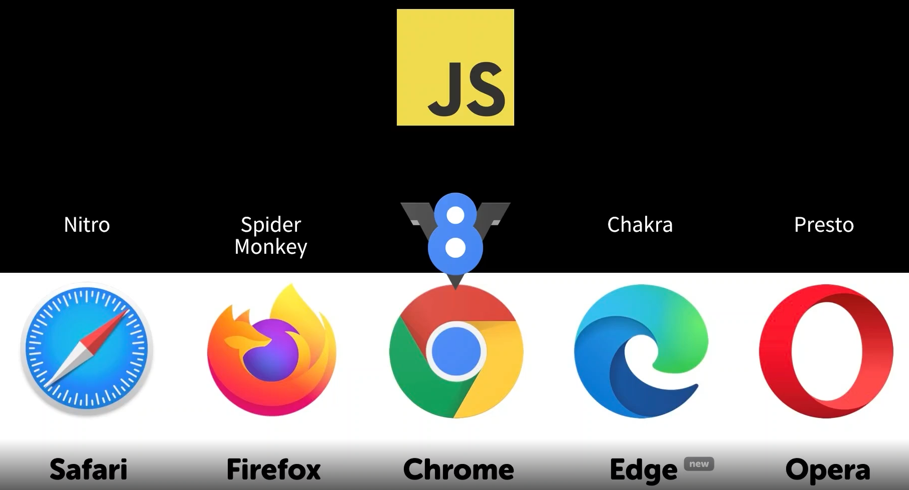
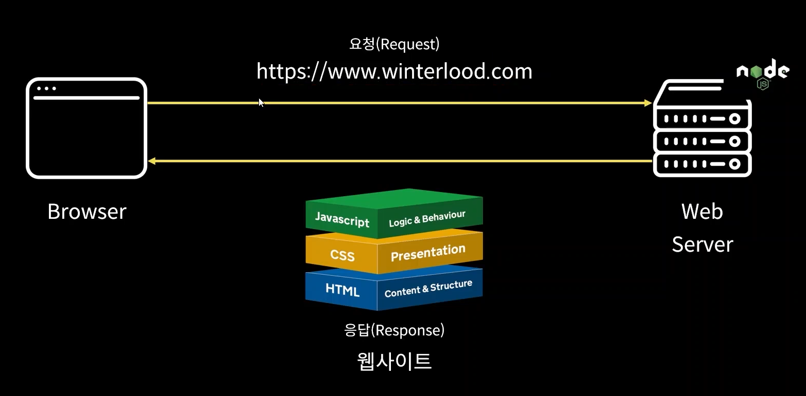

[Node.js란](#nodejs란)<br/>
[Node.js 설치하기](#nodejs-설치하기)<br/>

# Node.js란
### 자바스크립트 코드는 브라우저 내장 자바스크립트 엔진을 이용하여 실행된다. 그리고 각각의 브라우저는 자신들만의 엔진을 사용한다.
### 원래 자바스크립트는 브라우저 내에서만 사용 가능한 언어였지만 구글이 개발한 C++기반의 V8엔진이 나오면서 부터 V8엔진을 기반으로 자바스크립트를 브라우저 밖에서 사용하려는 시도를 하였고 그 결과물이 Node.js다. *자바스크립트의 실행 환경 = Javascript's Runtime
<br/>
<center></center>
<br/>

### 즉 nodeJs를 통해 웹 서버도 만들 수 있다.
<br/>
<center></center>
<br/>

# Node.js 설치하기
### Node.js설치 후 명령 프롬프트에서 node -v, npm -v를 통해 각각 설치된 버전을 확인할 수 있다.
<br/>

```js
node -v
// v18.12.1
npm -v
// 8.19.2
```
